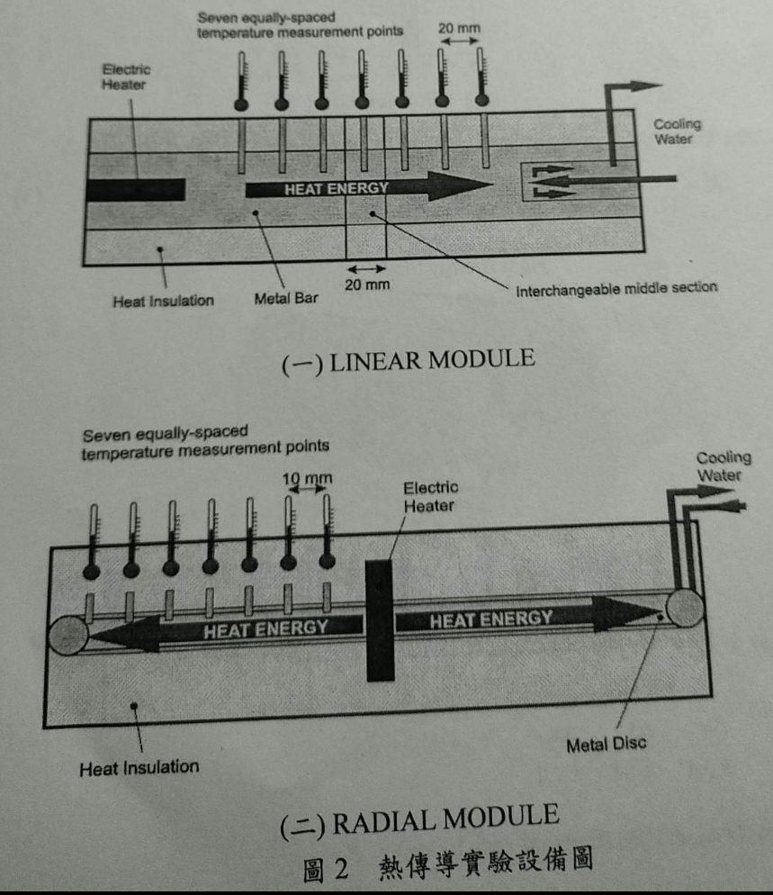
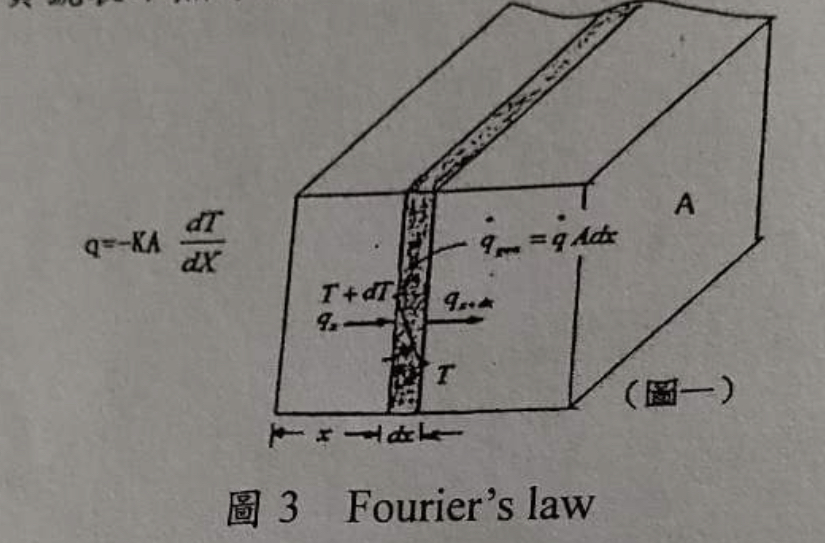
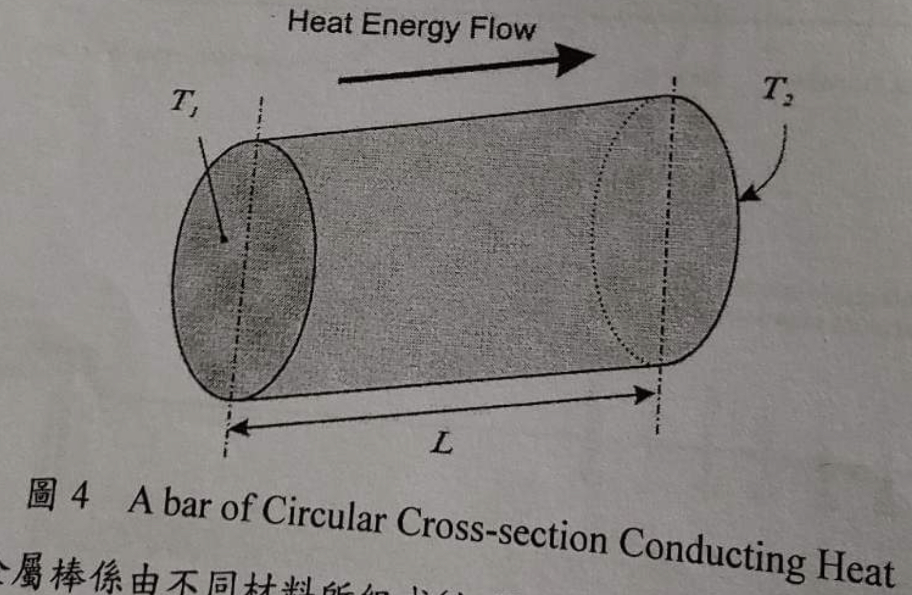
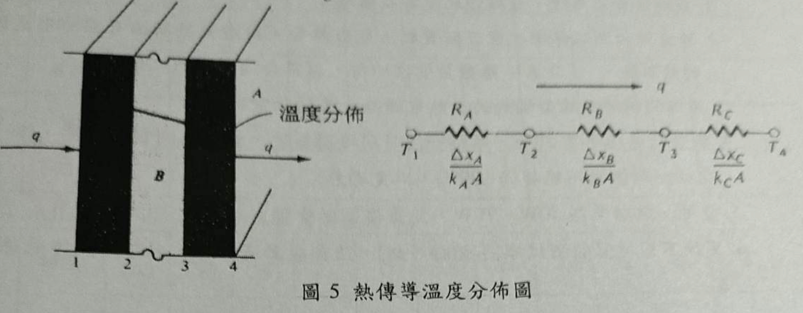
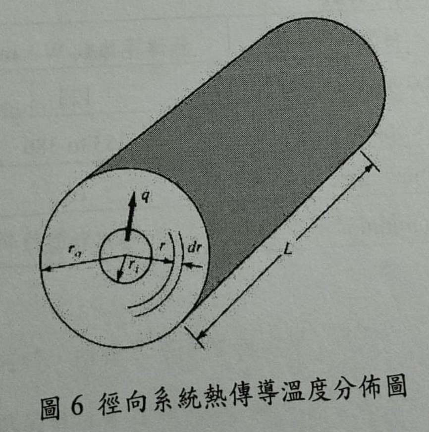

# 實驗2-1: 熱傳實驗I 熱傳導

## 1. 實驗目的

驗證在一維且穩態(one dimensional, steady state)下的傅立葉熱傳導定律(Fourier's law of heat conduction)。

## 2. 實驗設備

1. Heat Conduction Unit: 如圖二所示，分成兩種型號，線型模式與徑向模式。
    1. 線型模式：一邊有一個加熱器產生熱，熱會通過外圍有絕熱材質的金屬棒，金屬棒上面有7個溫度計，每個相隔10mm，可以測量溫度。另一邊有冷卻裝置維持溫度。
    2. 徑向模式：加熱器在中間，外圍有金屬盤導熱，有7個溫度計，每個相隔20mm。最外圈有冷卻裝置。
2. 線型模式的測試棒3隻，材質如下：
    1. $\phi 30\text{mm}$ 黃銅
    2. $\phi 13\text{mm}$ 黃銅
    3. $\phi 30\text{mm}$ 不鏽鋼
3. 溫度顯示器：用來插在 heat conduction unit 上面測量溫度。
4. 冷卻水系統：放在 heat conduction unit 的一邊作為冷卻裝置製造溫度差。

## 3. 實驗原理

1. 熱的傳導方式有三種：
    1. 熱傳導(thermal conduction)
    2. 熱對流(thermal convection)
    3. 熱輻射(thermal radiation)
2. Fourier's law 說明了熱傳導率與溫度梯度成正比。

$$q\propto \frac{\Delta T}{\Delta X}$$

- $q$: 熱傳導率
- $\displaystyle \frac{\Delta T}{\Delta X}$: 溫度梯度

3. 一維的 Fourier's law 可以寫成以下公式：

$$q = -KA \frac{dT}{dX}$$

- $A$: 截面積
- $K$: 熱傳導係數

根據以上公式，可以得出圓柱棒的熱傳導係數 $K$ 為

$$K = \frac{qL}{(T_1 - T_2)A}$$

4. 若金屬棒由不同材料組成，利用熱阻(thermal resistance)的概念可以得出熱傳導率為

$$q = \frac{T_1 - T_4}
           {\frac{\Delta x_A}{k_A A} + 
	    \frac{\Delta x_B}{k_B A} + 
	    \frac{\Delta x_C}{k_C A}}
    = \frac{T_1 - T_4}{R_A + R_B + R_C}$$

- $R_A, R_B. R_C$: 分別為 $A, B, C$ 材料的熱阻：

$$
\begin{array}{}
    R_A = \frac{\Delta x_A}{k_A A} \\
    R_B = \frac{\Delta x_B}{k_B A} \\
    R_C = \frac{\Delta x_C}{k_C A}
\end{array}
$$

5. 在徑向系統下，Fourier's law 可以寫成以下公式：

$$q = -KA \frac{dT}{dr} = -2\pi Kr L \frac{dT}{dr}$$

6. 考慮在內圈 $r = r_i$ 與外圈 $r = r_o$ 的溫度為 $T = T_i$ 與 $T = T_o$ ，則第五點的公式可以寫成：

$$q = 2\pi KL\frac{T_i - T_o}{\ln(r_o / r_i)}$$

## 4. 實驗步驟

### 4.1. 線型模式(linear module)
ㄛ
1. 開啟冷卻水馬達，並確認水流有在循環。
2. 於黃銅的測試棒兩端塗上矽質黏土或散熱膏，以避免接觸面有空隙形成新的熱阻抗(contact resistance)。
3. 接好測試棒及線型模式的加熱電源線，並開啟電源。
4. 調整加熱功率至 30W，等待一段時間達到穩態後，量取各測量點溫度。
    - 注意任一點溫度不能超過 $100\degree \text C$，以免過熱。
5. 變更加熱功率為 50W 和 70W，並重複上述步驟。
6. 更換不同材質的測試棒（不銹鋼、鋁），並重複上物步驟，求得其熱傳遞係數 $K$。

### 4.2. 徑向模式(radial module)

1. 拔出線型模式的加熱電源線更換為徑向模式的，並重複上述步驟，求得熱傳遞係數 $K$。

### 4.3 注意事項

1. 任一點溫度不能超過 $100\degree C$，以避免過熱。
2. 實驗過後的測試棒溫度非常高，注意避免燙傷。
3. 常用材料的熱傳導係數：

| 材質               | 熱傳導係數 $\text W \cdot \text{m}^{-1}\text{K}^{-1}$ |
| ------------------ | ---------- |
| Brass (type CZ121) | 123        |
| Copper             | 353 to 386 |
| Stainless Steel    | 16         |
| Aluminium          | 205 to 237 |

# 實驗2-2: 熱傳實驗II 熱對流交錯流熱交換器

## 1. 實驗目的

觀察管簇(tube bundle)的排列方式，對交錯流熱交換器(Cross-flow Heat Exchanger)熱傳效率之影響，並利用此方法應用在實際熱交換器的設計。

## 2. 實驗設備

1. 交錯流熱交換器：上方有進氣口，下方側邊有出氣口。風會在管道內流動。見下圖。包含以下部分：
    1. 空氣管道(Air Duct): 垂直的管道，由玻璃與強化塑膠製成。截面積為 $65\times 150 \text{mm}$，長約 $1.2\text{ m}$，上方為喇叭狀之進氣口，而正前方中央有一個高 $200\text{ mm}$ 的開口，將配合不同面板使用。
    2. 風扇
    3. 風扇氣門：在風扇出口處控制出口面積，以改變管道空氣流速。

2. 控制器(Instrument Console)
3. 加熱棒(Heater Element): 利用電力加熱的銅棒
    1. 直徑：$15.8\text{ mm}$
    2. 長度：$50\text{ mm}$
    3. 加熱表面積：$2.482\text{ m}^2$
    4. 電阻$R$：$70\Omega$
4. 標準面板(Standard Tube Plates)：
    1. 單管面板(Single Tube Plate)：一個高 $200\text{ mm}$ 的壓克力板，中間有一個孔可以插入加熱棒。
    2. 多管面板(Multi-Tube Plate)：和單管面板的尺寸相似，但有27根塑膠管在上面。可以拔掉替換為加熱棒。
5. 溫度計：電子溫度計，用來測量加熱棒表面溫度與管道內空氣的溫度。
6. 伏特計：類比伏特計，用來量測通過加熱棒的電壓。

## 3. 實驗原理

1. 熱量的基本傳遞方式有三種：
    1. 熱傳導(thermal conduction)
    2. 熱對流(thermal convection)
    3. 熱輻射(thermal radiation)
2. 工業上常利用流體來傳送熱能，利用熱交換器交換兩種或多種不同溫度流體間的熱量。
3. 熱交換器有許多形式，其中常見的一種是交錯流熱交換器(Cross-flow Heat Exchanger)。此交換器有一個流體在管簇內流動，另一流體在管簇外流動，以達到熱交換效果，如下圖：

4. 交錯流熱交換器的筒體，其熱傳導係數(Heat Transfer Coefficient)由三個因素決定：
    1. 流體流經管內的表面熱傳係數。
    2. 管壁的熱傳導係數與厚度。
    3. 流體流經管外的表面熱傳係數。
5. 上面的三個因素中：
    1. 第一、二項可以藉由增加流速和減少管壁厚度，或使用高熱傳導係數的管材增加熱傳效果。
    2. 第三項可以藉由提升外部流體的流速（增加雷諾數）來提升表面熱傳係數。
    3. 變更管簇的排列方式也可以提升熱傳效率，減少熱交換器體積。變更管簇排列可以產生紊流，增加表面熱傳係數。本實驗測量這部分的影響。
6. 流體分為兩種流：
    1. 層流：流速慢且流線不會交錯混淆，主要靠熱傳導(conduction)來傳遞熱量。
    2. 紊流：流速快且流線相互混雜，可以快速傳遞熱量。雷諾數越高，熱傳效果越好。
7. 我們定義以下三個常數：

$$
\begin{array}{l}
    \text{Reynolds number: } & \text{Re}=\frac{\rho Ud}{\mu} \\
    \text{Prandtl number: } & \text{Pr}=\frac{C_p\mu}{k} \\
    \text{Nusselt number: } & \text{Nu}=\frac{hd}{k}
\end{array}
$$

- $k$: thermal conductivity
- $h$: surface heat transfer coefficient

8. 因為熱對流系統複雜，所以會用動力相似(dynamic similarity)的原理來分析，可以得出 Nusselt number 是雷諾數($\text{Re}$)與 Prandtl number 的函數：

$$\text{Nu} = f(\text{Re}, \text{Pr})$$

9. 無因次分析可以得到：

$$\text{Nu} = C \text{Re}^m \text{Pr}^n$$

- $C, m, n$: 常數

10. 經由實驗可以得到單管管子在交錯流熱交換器的 Nusselt number 為

$$\implies \text{Nu} = 0.714 \text{Re}^{0.618}$$

11. 當雷諾數介於 $4000 \sim 40000$ 時，將上式代入 Nusselt number 的定義可以得到：

$$h = \frac{k}{d}0.714 \text{Re}^{0.618}$$

12. 在多管管簇的交錯流熱交換器中，管道的截面積會縮小，導致流經管簇周邊的流體流速增加。流速可以用下面的公式修正：

$$U' = U \frac{A_d}{A_t}$$

- $A_d$: 無管簇的管道截面積
- $A_t$: 有管簇時的管道截面積

13. 經由實驗我們可以得到多管管簇在交錯流熱交換器的 Nusselt number 為：

$$
\text{Nu} = 0.273 \text{Re}^{0.635} \text{Pr}^{0.34} \text{Fn} \qquad \text{當 Re 介於 300~200000}
$$

- $\text{Fn}$: a function of the number of tube rows crossed by the transverse stream.

| Number of Rows Crossed | 2   | 3    | 4   | 5    | 6    | 8    | 10  |
| ---------------------- | --- | ---- | --- | ---- | ---- | ---- | --- |
| $\text{Fn}$            | 0.8 | 0.84 | 0.9 | 0.93 | 0.96 | 0.98 | 1   |

## 4. 相關計算

1. 加熱棒的熱傳率：

$$\dot Q = \frac{V^2}{R}$$

- $V$: 加熱棒的電壓
- $R$: 加熱棒的電阻，$70\Omega$

2. 熱通量：

$$\phi = \frac{\dot Q}{A}$$

- $A$: 加熱棒的表面積，$2.482 \times 10^{-3} \text{m}^2$

3. 加熱棒表面與空氣間之溫差：

$$T_s - T_a = \Delta T$$

- $T_a$: 管道內空氣溫度

4. 平均表面熱傳係數(Mean Surface Heat Transfer Coefficient) $h$:

$$
\begin{array}{l}
\displaystyle \phi = \frac{\dot Q}{A} = h(T_s - T_a) \\
\displaystyle h = \frac{\phi}{(T_s - T_a)}
\end{array}
$$

5. 管道空氣速度：
    1. 單管：直接利用風速計測得風速$U$。
    2. 多管：當管道內有管簇時，空氣流速會因為截面積的縮減而加快。因此空氣速度修正為：

$$
\begin{array}{l}
    U' = U \times \frac{A_d}{A_t} \\
    \qquad A_d: \text{無管簇時的管道截面積} 
           = 0.065\text{m} \times 0.15\text{m} 
	   = 9.75 \times 10^{-3} \text{m}^2 \\
    \qquad A_t: \text{無管簇時的管道截面積}
           = 4.16 \times 10^{-3} \text{m}^2 \\
    U' = 2.343 U
\end{array}
$$

6. 雷諾數：

$$\text{Re} = \frac{U\cdot d}{v}$$

7. Nusselt number：

$$
\begin{array}{l}
    \text{單管：} & \displaystyle 
                    \text{Nu} = \frac{h \cdot d}{k}
		    = 0.174 \text{Re}^{0.618} \\
    \text{多管：} & \text{Nu} 
                    = 0.273 \text{Re}^{0.635} \text{Pr}^{0.34} \text{Fn}
\end{array}
$$

- $\text{Fn}$: for 6 rows, 0.96

8. 平均表面熱傳係數（理論值）

$$
\begin{array}{l}
    \text{單管：} & h = \frac{k}{d}0.174 \text{Re}^{0.618} 
                      = 0.283 \text{Re}^{0.618} \\
    \text{多管：} & h = \frac{k}{d} 0.273 \text{Re}^{0.635} 
                        \text{Pr}^{0.34}
\end{array}
$$

9. 參考數據：

- 加熱棒的直徑：$d = 15.8\text{mm}$
- 加熱棒的表面積：$A = 2.482 \times 10^{-3}\text{m}^2$
- 空氣：$v = 15.34 \times 10^{-6} \text{m}^2 \text{s}^{-1}$
- 加熱棒的長度：$L = 50 \text{mm}$
- 管道的截面積：$A_d = 0.065 \text{m} \times 0.15 \text{m} = 9.75\times 10^{-3} \text{m}^2$
- 空氣的 Prandtl number：$\text{Pr} = 0.7$

## 5. 實驗步驟

### 5.1. 單管

1. 確定加熱控制器與風扇的開關在OFF位置。
2. 將單管面板安裝好。若面板接合不良，可以用面板四個角落的旋鈕調整後放置。
3. 將加熱棒插入面板的插孔中。
4. 調整風扇氣門至位置8，並開啟風扇馬達。
5. 調整加熱控制器之主旋鈕，將加熱棒溫度 $T_s$ 控制在 $95\degree \text C$ 的指示值。
6. 利用風速計測量進口處的空氣流速。
7. 當$T_s$ 達到穩定時，記錄加熱棒溫度 $T_s$、管道溫度$T_a$、風速$U$ 和電壓 $V$。
8. 依序更換不同的風扇氣門開度，並重覆前述步驟。

### 5.2. 多管

1. 將單管面板換成多管面板，並將加熱棒插入第1列(最上面)的位置，其餘步驟與單管相同。
2. 將加熱棒抽換至下一列，並重複前述步驟，直到 $6^{\text{th}}$ row。

### 5.3. 注意事項

1. 為求得較正確的數據，本實驗費時較久，請同學耐心完成之。
2. 加熱棒溫度很高（$95 \degree \text C$），抽換時要特別小心，以免燙傷。

# 實驗2-3: 熱傳實驗II熱對流雙管熱交換器

## 1. 實驗目的

了解熱交換器在內、外管不同的流向及流率下，對熱傳效率之影響，並利用此方法應用在實際熱交換器的設計上。

## 2. 實驗設備

1. 雙管熱交換器 (Double pipe heat exchangers)：由管子組合而成的熱交換器，可以加入熱水和冷水觀察熱交換。流程圖如下圖。包括以下部份：
	1. 冷、熱水管管道(Tube)：分為上下兩段，每段長度均為3ft，其中冷水流經外部的粗管道(外徑=1.125"、管厚=0.05")，熱水流經內部的細管道(外徑=0.625"、管厚=0.04")。
	2. 冷、熱水流量計(Flowmeter)：測量冷、熱水的流量。
	3. 水閥開關(Valve)：可控制熱水的流向，使順向流(parallel flow)變為逆向流(counter flow)或逆向流變為順向流。
	4. 溫度感測器(Temperature Sensor)：為一旋轉鈕，上面有1~6號的標示，可分別測得管道進口處、中間點、出口處的冷、熱水溫度。

2. 熱水爐(heat adding machine)：容量80L的熱水爐，由電力加熱水溫，水溫達到$65\degree \text C$時停止加熱。

## 3. 實驗原理

### 3.1. 熱膠換器種類

熱交換器可以促進兩種或不同溫度的流體進行熱傳遞，依據流動方向不同可以分為以下幾種：
	1. 平行流(parallel flow)：高、低溫流體方向相同，熱交換效果較差。
	2. 逆向流(counter flow)：高、低溫流體流向相反。
	3. 交叉流(cross flow)：高、低溫流體流向互相垂直，熱交換效果較佳。

### 3.2. 流體平均溫度推導

以下為求得流體平均溫度的過程：
1. 溫度差異為熱交換器中熱傳導的動力。牛頓冷卻定律(Newton's law of cooling)定義了熱傳率與溫度差異的關係：
$$q = hA \Delta T = hA (T_s - T)$$
- $q$: 熱傳率
- $h$: 熱對流係數(convection heat-transfer coefficient)
- $A$: 與流體接觸之管壁表面積
- $T_s$: 管壁表面溫度
- $T$: 流體溫度

2. 對於黏性、在管內流動的流體，速度分佈為半徑的函數$u = f(r)$，因此可以由Bermoulli's equation 得到完全發展流(Fully develop flow)的平均流速(Mean Fluid Velocity) $u_m$ 以及流量$Q_V$：
$$
\begin{array}{}
	u_m &=& 
	\displaystyle
	\sqrt{\frac{2\Delta P}{\rho}} \\
	Q_V &=& 
	\displaystyle
	\frac{\pi D^2 u_m}{4}
\end{array}
$$
3. 除了速度分佈外，溫度分佈也為半徑的函數$T = f(r)$。溫度分佈可以用以下公式代表：
$$T_m = \frac{q}{\rho Q_V C_P}$$
- $q$: 熱傳率
- $Q_V$: 流量
- $C_P$: 比熱
- $\rho$: 流體密度

### 3.3. 雙管式熱交換器

以下為推導內外流體的整體熱傳係數：

1. 考慮上圖的雙管式熱交換器，內外流體的整體熱傳率可以表示為：

$$q = \frac{T_A - T_B}{\displaystyle 
	\frac{1}{hA} + \frac{
		\displaystyle\ln(\frac{r_o}{r_i})
	}{2\pi kL} + \frac{1}{h_oA_o}
}$$
- $A_i$, $A_o$: 內管(inner tube)的內、外表面積
- $r_i, r_o$: 內管的內、外半徑
- $L$: 管長
- $T_A - T_B$: A流體與B流體溫度差

2. 整體熱傳率也可以表示為：

$$q = UA_m \Delta T_m = U_oA_o\Delta T_m = U_iA_i\Delta T_m$$

- $\Delta T_m$: 通過熱交換器的平均溫度差
- $A_m$: 平均熱傳面積
- $U$: 整體熱傳係數

3. 經過移項，上式可以變為：

$$U = \frac{q}{A_m\Delta T_m} = \frac{q}{2\pi r_m L \Delta T_m}$$

- $r_m$: 平均半徑，$(r_i + r_o)/2$
- $A_m$: 平均熱傳面積，本實驗中$\displaystyle A_m = 2\pi\left(\frac{r_i + r_o}{2}\right)L \times 2 = 0.085 \text m^2$

4. 內外流體的整體熱傳係數分別為：

$$
\begin{array}{}
	U_i &=&
	\displaystyle
	\frac{1}{
		\displaystyle
		\frac{1}{h_i} +
		\frac{
			\displaystyle 
			A_i \ln\left(\frac{r_o}{r_i}\right)
		}{2\pi kL} +
		\frac{A_i}{h_oA_o}
	} \\ \\
	U_o &=& 
	\displaystyle
	\frac{1}{
		\displaystyle
		\frac{A_o}{h_iA_i} +
		\frac{
			A_o \ln \left(
				\displaystyle
				\frac{r_o}{r_i}
			\right)
		}{2\pi kL} +
		\frac{1}{h_o}
	}
\end{array}
$$
### 3.4. 順向流與逆向流

考慮內外流體流動方向，可以分為順向流(parallel flow)與逆向流(counter flow)，如下圖：

#### 3.4.1. 順向流(parallel flow)之平均溫度差

以下為順向流的平均溫度差推導過程：

1. 實際冷熱流體的溫度上升或下降並非直線，因此我們需要經過微小區域dA的熱傳量，如上圖所示。假設熱交換器沒有任何熱損失與相變化，可以由冷、熱流體的溫度變化求得：

$$
\begin{array}{}
	\text{冷流體的熱傳量：} & dq_c &=& \dot m_c C_c dT_c \\
	\text{熱流體的熱傳量：} & dq_h &=& -\dot m_h C_h dT_h
\end{array}
$$

- $\dot m$: 質量流率
- $C$: 流體的比熱
- 下標$c, h$: 代表冷、熱流體

2. 由於不考慮熱損失，所以熱流體釋放出的熱量等於冷流體吸收的熱量。

$$dq = dq_h = dq_c \implies dq = -\dot m_h C_h dT_h = \dot m_c C_c dT_c$$

3. 移項並得出微小區域冷熱溫度差：

$$
\begin{array}{rl}
	dT_h &=& 
	\displaystyle
	-\frac{dq}{\dot m_h C_h} \\
	dT_c &=&
	\displaystyle
	\frac{dq}{\dot m_c C_c} \\
	dT_h - dT_c &=& d(T_h - T_c) &=& 
	\displaystyle
	-dq \left(
		\frac{1}{\dot m_h C_h} +
		\frac{1}{\dot m_c C_c}
	\right)
\end{array}
$$

4. 微小區域dA的導熱量可以表示為$dq = U(T_h - T_c)dA$，將此代入上式可以得到：

$$\frac{d(T_h - T_c)}{T_c - T_c} = -U
\left(
	\frac{1}{\dot m_h C_h} + \frac{1}{\dot m_c C_c}
\right)dA
$$

5. 將兩側積分可以得到

$$\ln\frac{
	T_{h2} - T_{c2}
}{
	T_{h1} - T_{c1}
} = -UA
\left(
	\frac{1}{\dot m_h C_h} +
	\frac{1}{\dot m_c C_c}
\right)$$

6. 由步驟1的冷熱流體的熱傳量積分，可以得到$q_c = q = \dot m_c C_c (T_{c2} - T_{c1})$ 與$q_h = q = \dot m_h C_h(T_{h1} - T_{h2})$。將上式利用此結果代換為$q$可以得到：

$$
\begin{array}{rl}
	\displaystyle
	\ln\frac{
		T_{h2} - T_{c2}
	}{
		T_{h1} - T_{c1}
	} &=&
	\displaystyle
	-UA
	\left(
		\frac{
			T_{h1} - T_{h2}
		}{q} +
		\frac{
			T_{c2} - T_{c1}
		}{q}
	\right) \\
	q &=& 
	\displaystyle
	UA\frac{
		(T_{h2} - T_{c2}) - 
		(T_{h1} - T_{c1})
	}{
		\displaystyle
		\ln \left(
			\frac{
				T_{h2} - T_{c2}
			}{
				T_{h1} - T_{c1}
			}
		\right)
	}
\end{array}
$$

7. $q = UA\Delta T_m$，因此上式可以用此式替換得

$$\Delta T_m = \frac{
	(T_{h2} - T_{c2}) - 
	(T_{h1} - T_{c1})
}{
	\displaystyle
	\ln\left(
		\frac{
			T_{h2} - T_{c2}
		}{
			T_{h1} - T_{c1}
		}
	\right)
} = 
\frac{
	\Delta T_2 - \Delta T_1
}{
	\ln\left(
		\displaystyle
		\frac{
			\Delta T_2
		}{
			\Delta T_1
		}
	\right)
}$$

此式稱為對數平均溫度差(logarithmic mean temperature difference)。

#### 3.4.2. 逆向流(counter flow)之平均溫度差

因為在逆向流冷、熱流體的流動相反，因此我們將逆向流入口溫度定義為$T_{h2}$、出口溫度定義為$T_{h1}$，如3.4小節中定義的圖中所示。依照前述的推導可以得到類似的結果：

$$
\Delta T_m = \frac{
	(T_{h2} - T_{c2}) - 
	(T_{h1} - T_{c1})
}{
	\displaystyle
	\ln\left(
		\frac{
			T_{h2} - T_{c2}
		}{
			T_{h1} - T_{c1}
		}
	\right)
} = 
\frac{
	\Delta T_2 - \Delta T_1
}{
	\ln\left(
		\displaystyle
		\frac{
			\Delta T_2
		}{
			\Delta T_1
		}
	\right)
}
$$

## 4. 實驗步驟

### 4.1. 步驟

1. 打開總熱水開關，並確定有水流出。
2. 打開熱水爐電源加熱（需一段時間）。
3. 待加熱至$65\degree \text C$後，打開冷、熱水閥，讓冷、熱水流入管道循環流動。
4. 開啟熱水的熱循環馬達。（不能太早開啟，會燒毀）
5. 開啟1與3號閥，並關閉2與4號閥，讓水流變成順向流。
6. 等待一段時間到系統達成平衡，並記錄冷、熱水管進、出口與中間點的溫度及冷、熱水管的流量$Q$。
7. 開啟2與4號閥，關閉1與3號閥，讓水流變為逆向流，重複上述步驟。
8. 實驗結束後，將循環馬達及熱水爐電源關閉，並關閉總水閥。

### 4.2. 注意事項

1. 等待熱水爐加熱時，不要開啟熱水循環馬達，以免馬達長時間運轉導致過熱燒毀。
2. 開啟熱水循環馬達前，應先確認熱水管道上所有閥門已打開，且馬達開啟後要再確認熱水有正常循環流動，以免馬達長期空轉導致過熱燒毀。