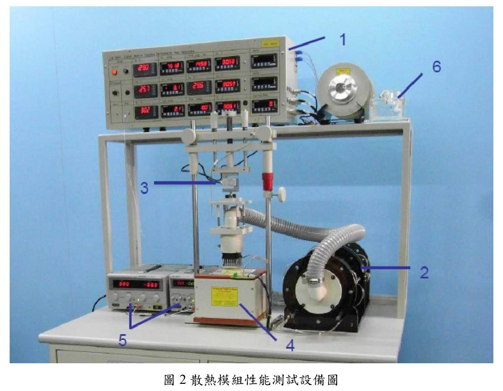

# Table of Contents

- #TODO

# 實驗2-1: 熱傳實驗I 熱傳導

## 1. 實驗目的

驗證在一維且穩態(one dimensional, steady state)下的傅立葉熱傳導定律(Fourier's law of heat conduction)。

## 2. 實驗設備

1. Heat Conduction Unit: 如圖二所示，分成兩種型號，線型模式與徑向模式。
    1. 線型模式：一邊有一個加熱器產生熱，熱會通過外圍有絕熱材質的金屬棒，金屬棒上面有7個溫度計，每個相隔10mm，可以測量溫度。另一邊有冷卻裝置維持溫度。
    2. 徑向模式：加熱器在中間，外圍有金屬盤導熱，有7個溫度計，每個相隔20mm。最外圈有冷卻裝置。
2. 線型模式的測試棒3隻，材質如下：
    1. $\phi 30\text{mm}$ 黃銅
    2. $\phi 13\text{mm}$ 黃銅
    3. $\phi 30\text{mm}$ 不鏽鋼
3. 溫度顯示器：用來插在 heat conduction unit 上面測量溫度。
4. 冷卻水系統：放在 heat conduction unit 的一邊作為冷卻裝置製造溫度差。

## 3. 實驗原理

1. 熱的傳導方式有三種：
    1. 熱傳導(thermal conduction)
    2. 熱對流(thermal convection)
    3. 熱輻射(thermal radiation)
2. Fourier's law 說明了熱傳導率與溫度梯度成正比。

$$q\propto \frac{\Delta T}{\Delta X}$$

- $q$: 熱傳導率
- $\displaystyle \frac{\Delta T}{\Delta X}$: 溫度梯度

3. 一維的 Fourier's law 可以寫成以下公式：

$$q = -KA \frac{dT}{dX}$$

- $A$: 截面積
- $K$: 熱傳導係數

根據以上公式，可以得出圓柱棒的熱傳導係數 $K$ 為

$$K = \frac{qL}{(T_1 - T_2)A}$$

4. 若金屬棒由不同材料組成，利用熱阻(thermal resistance)的概念可以得出熱傳導率為

$$q = \frac{T_1 - T_4}
           {\frac{\Delta x_A}{k_A A} + 
	    \frac{\Delta x_B}{k_B A} + 
	    \frac{\Delta x_C}{k_C A}}
    = \frac{T_1 - T_4}{R_A + R_B + R_C}$$

- $R_A, R_B. R_C$: 分別為 $A, B, C$ 材料的熱阻：

$$
\begin{array}{}
    R_A = \frac{\Delta x_A}{k_A A} \\
    R_B = \frac{\Delta x_B}{k_B A} \\
    R_C = \frac{\Delta x_C}{k_C A}
\end{array}
$$

5. 在徑向系統下，Fourier's law 可以寫成以下公式：

$$q = -KA \frac{dT}{dr} = -2\pi Kr L \frac{dT}{dr}$$

6. 考慮在內圈 $r = r_i$ 與外圈 $r = r_o$ 的溫度為 $T = T_i$ 與 $T = T_o$ ，則第五點的公式可以寫成：

$$q = 2\pi KL\frac{T_i - T_o}{\ln(r_o / r_i)}$$

## 4. 實驗步驟

### 4.1. 線型模式(linear module)

1. 開啟冷卻水馬達，並確認水流有在循環。
2. 於黃銅的測試棒兩端塗上矽質黏土或散熱膏，以避免接觸面有空隙形成新的熱阻抗(contact resistance)。
3. 接好測試棒及線型模式的加熱電源線，並開啟電源。
4. 調整加熱功率至 30W，等待一段時間達到穩態後，量取各測量點溫度。
    - 注意任一點溫度不能超過 $100\degree \text C$，以免過熱。
5. 變更加熱功率為 50W 和 70W，並重複上述步驟。
6. 更換不同材質的測試棒（不銹鋼、鋁），並重複上物步驟，求得其熱傳遞係數 $K$。

### 4.2. 徑向模式(radial module)

1. 拔出線型模式的加熱電源線更換為徑向模式的，並重複上述步驟，求得熱傳遞係數 $K$。

### 4.3 注意事項

1. 任一點溫度不能超過 $100\degree C$，以避免過熱。
2. 實驗過後的測試棒溫度非常高，注意避免燙傷。
3. 常用材料的熱傳導係數：

| 材質               | 熱傳導係數 $\text W \cdot \text{m}^{-1}\text{K}^{-1}$ |
| ------------------ | ---------- |
| Brass (type CZ121) | 123        |
| Copper             | 353 to 386 |
| Stainless Steel    | 16         |
| Aluminium          | 205 to 237 |

## 5. 實驗結果

### 5.1. Linear Module (表格數值填寫真值即可)

| Test No. | 材質   | I (A) | V (V) | Q (W)  | T1   | T2   | T3   | T4   | T5   | T6   | T7   | K值  |
| -------- | ------ | ----- | ----- | ------ | ---- | ---- | ---- | ---- | ---- | ---- | ---- | ---- |
| 1        | 黃銅   | 1.57  | 9.6   | 15.072 | 50.4 | 48.0 | 44.8 | 38.2 | 29.0 | 26.8 | 24.8 | 99.9493 |
| 2        | 黃銅   | 2.2   | 13.5  | 29.7   | 76.3 | 71.2 | 65.4 | 52.3 | 36.0 | 31.7 | 27.7 | 103.7454 |
| 3        | 不鏽鋼 | 1.55  | 9.6   | 14.88  | 46.0 | 44.3 | 42.0 | 34.4 | 26.3 | 24.8 | 23.6 | 112.7726 |
| 4        | 不鏽鋼 | 2.19  | 13.5  | 29.565 | 68.0 | 63.9 | 59.5 | 44.7 | 29.6 | 27.1 | 24.9 | 116.4527 |

### 5.2. Radial Module (表格數值填寫真值即可)

| Test No. | 材質 | I (A) | V (V) | Q (W)  | T1   | T2   | T3   | T4   | T5   | T6   | T7   | K值      |
| -------- | ---- | ----- | ----- | ------ | ---- | ---- | ---- | ---- | ---- | ---- | ---- | -------- |
| 1        | 黃銅 | 1.58  | 9.1   | 14.378 | 28.5 | 27.2 | 26.0 | 24.9 | 24.2 | 23.5 | 22.9 | 159.0316 |
| 2        | 黃銅 | 2.29  | 13.3  | 30.457 | 33.9 | 31.2 | 29.2 | 27.1 | 25.8 | 24.6 | 23.7 | 184.9524 |

### 5.3. 繪圖求熱傳遞係數K值

依照公式可以得出線性與徑向的K值：

$$
\begin{array}{}
	K_{linear} &=& 
	\displaystyle
	\frac{qL}{(T_1 - T_2)A} \\
	K_{radial} &=& 
	\displaystyle
	\frac{q\ln (r_o / r_i)}{2\pi L (T_i - T_o)}
\end{array}
$$

$$
\implies 
\left\{
	\begin{array}{}
		K_{linear, 1} &=&
		\displaystyle
		\frac{
			15.072 \times (0.02 \times 6)
		}{
			(50.4 - 24.8) \times 0.015^2\pi
		} &=& 99.9493 \\
		K_{linear, 2} &=&
		\displaystyle
		\frac{
			29.7 \times (0.02 \times 6)
		}{
			(76.3 - 27.7) \times 0.015^2\pi
		} &=& 103.7454 \\
		K_{linear, 3} &=&
		\displaystyle
		\frac{
			14.88 \times (0.02 \times 6)
		}{
			(46.0 - 23.6) \times 0.015^2\pi
		} &=& 112.7726 \\
		K_{linear, 4} &=&
		\displaystyle
		\frac{
			29.565 \times (0.02 \times 6)
		}{
			(68.0 - 24.9) \times 0.015^2\pi
		} &=& 116.4527 \\
		K_{radial, 1} &=&
		\displaystyle
		\frac{14.378 \times \ln(\frac{0.01 \times 7}{0.01\times 1})}{2\pi \times 0.005 \times (28.5 - 22.9)} &=&
		159.0316 \\
		K_{radial, 2} &=&
		\displaystyle
		\frac{30.457 \times \ln(\frac{0.01 \times 7}{0.01\times 1})}{2\pi \times 0.005 \times (33.9 - 23.7)} &=& 184.9524
	\end{array}
\right.
$$

## 6. 問題與討論

1. 就實驗曲線所得熱傳遞係數K值與查表所得精確值比較，並解釋所得結果？

以下為實驗所得與查表所得熱傳導係數比較：

| 模組          | Test No. | 材質   | 實驗值 K值 | 查表 K值 | 誤差值  |
| ------------- | -------- | ------ | ---------- | -------- | ------- |
| Linear Module | 1        | 黃銅   | 99.9493    | 123      | -18.74% |
|               | 2        | 黃銅   | 103.7454   | 123      | -15.65% |
|               | 3        | 不鏽鋼 | 112.7726   | 16       | 604.83% |
|               | 4        | 不鏽鋼 | 116.4527   | 16       | 627.83% | 
| Radial Module | 1        | 黃銅   | 159.0316   | 123      | 29.29%  |
|               | 2        | 黃銅   | 184.9524   | 123      | 50.37%  |

不鏽鋼的部份，實驗的K值遠高於查表的K值，並且數值接近黃銅，因此我們懷疑再做實驗時有可能誤拿黃銅做實驗，但我們已無法確認。

黃銅在線性模組中K值低於查表值，代表傳導的速度低於預期。這可能是因為散熱膏沒有塗好，導致中間有氣泡影響散熱效果。

在徑向模組中，黃銅的K值皆高於查表值。這個是因為徑向的散熱較快，相比於查表值熱傳較快。

2. 當加熱功率不同時，所得K值是否有改變？如有，其理由為何？

當加熱功率增加時，K值也會些微的增加。這是由於溫度較高時，分子間的運動加快，造成熱傳的效果變好。

3. 在穩態下所讀取的數據才有效，你做到了這一點嗎？

是，我們只有在斜率沒有變化時讀取數據。

4. 本實驗還有哪些需改良的地方？其如何改善？

在計算不鏽鋼的熱傳導係數時與查表值相差很遠，我希望可以知道為什麼這會發生。

## 7. 心得與建議

這次的實驗做很久，非常耗時，相較其他實驗花了更久時間達到穩態。希望可以知道為什麼這個實驗達到穩態需要這麼久，並且有沒有方法可以計算達到穩態的時間。

# 實驗2-2: 熱傳實驗II 熱對流交錯流熱交換器

## 1. 實驗目的

觀察管簇(tube bundle)的排列方式，對交錯流熱交換器(Cross-flow Heat Exchanger)熱傳效率之影響，並利用此方法應用在實際熱交換器的設計。

## 2. 實驗設備

1. 交錯流熱交換器：上方有進氣口，下方側邊有出氣口。風會在管道內流動。見下圖。包含以下部分：
    1. 空氣管道(Air Duct): 垂直的管道，由玻璃與強化塑膠製成。截面積為 $65\times 150 \text{mm}$，長約 $1.2\text{ m}$，上方為喇叭狀之進氣口，而正前方中央有一個高 $200\text{ mm}$ 的開口，將配合不同面板使用。
    2. 風扇
    3. 風扇氣門：在風扇出口處控制出口面積，以改變管道空氣流速。

2. 控制器(Instrument Console)
3. 加熱棒(Heater Element): 利用電力加熱的銅棒
    1. 直徑：$15.8\text{ mm}$
    2. 長度：$50\text{ mm}$
    3. 加熱表面積：$2.482\text{ m}^2$
    4. 電阻$R$：$70\Omega$
4. 標準面板(Standard Tube Plates)：
    1. 單管面板(Single Tube Plate)：一個高 $200\text{ mm}$ 的壓克力板，中間有一個孔可以插入加熱棒。
    2. 多管面板(Multi-Tube Plate)：和單管面板的尺寸相似，但有27根塑膠管在上面。可以拔掉替換為加熱棒。
5. 溫度計：電子溫度計，用來測量加熱棒表面溫度與管道內空氣的溫度。
6. 伏特計：類比伏特計，用來量測通過加熱棒的電壓。

## 3. 實驗原理

1. 熱量的基本傳遞方式有三種：
    1. 熱傳導(thermal conduction)
    2. 熱對流(thermal convection)
    3. 熱輻射(thermal radiation)
2. 工業上常利用流體來傳送熱能，利用熱交換器交換兩種或多種不同溫度流體間的熱量。
3. 熱交換器有許多形式，其中常見的一種是交錯流熱交換器(Cross-flow Heat Exchanger)。此交換器有一個流體在管簇內流動，另一流體在管簇外流動，以達到熱交換效果，如下圖：

4. 交錯流熱交換器的筒體，其熱傳導係數(Heat Transfer Coefficient)由三個因素決定：
    1. 流體流經管內的表面熱傳係數。
    2. 管壁的熱傳導係數與厚度。
    3. 流體流經管外的表面熱傳係數。
5. 上面的三個因素中：
    1. 第一、二項可以藉由增加流速和減少管壁厚度，或使用高熱傳導係數的管材增加熱傳效果。
    2. 第三項可以藉由提升外部流體的流速（增加雷諾數）來提升表面熱傳係數。
    3. 變更管簇的排列方式也可以提升熱傳效率，減少熱交換器體積。變更管簇排列可以產生紊流，增加表面熱傳係數。本實驗測量這部分的影響。
6. 流體分為兩種流：
    1. 層流：流速慢且流線不會交錯混淆，主要靠熱傳導(conduction)來傳遞熱量。
    2. 紊流：流速快且流線相互混雜，可以快速傳遞熱量。雷諾數越高，熱傳效果越好。
7. 我們定義以下三個常數：

$$
\begin{array}{l}
    \text{Reynolds number: } & \text{Re}=\frac{\rho Ud}{\mu} \\
    \text{Prandtl number: } & \text{Pr}=\frac{C_p\mu}{k} \\
    \text{Nusselt number: } & \text{Nu}=\frac{hd}{k}
\end{array}
$$

- $k$: thermal conductivity
- $h$: surface heat transfer coefficient

8. 因為熱對流系統複雜，所以會用動力相似(dynamic similarity)的原理來分析，可以得出 Nusselt number 是雷諾數($\text{Re}$)與 Prandtl number 的函數：

$$\text{Nu} = f(\text{Re}, \text{Pr})$$

9. 無因次分析可以得到：

$$\text{Nu} = C \text{Re}^m \text{Pr}^n$$

- $C, m, n$: 常數

10. 經由實驗可以得到單管管子在交錯流熱交換器的 Nusselt number 為

$$\implies \text{Nu} = 0.714 \text{Re}^{0.618}$$

11. 當雷諾數介於 $4000 \sim 40000$ 時，將上式代入 Nusselt number 的定義可以得到：

$$h = \frac{k}{d}0.714 \text{Re}^{0.618}$$

12. 在多管管簇的交錯流熱交換器中，管道的截面積會縮小，導致流經管簇周邊的流體流速增加。流速可以用下面的公式修正：

$$U' = U \frac{A_d}{A_t}$$

- $A_d$: 無管簇的管道截面積
- $A_t$: 有管簇時的管道截面積

13. 經由實驗我們可以得到多管管簇在交錯流熱交換器的 Nusselt number 為：

$$
\text{Nu} = 0.273 \text{Re}^{0.635} \text{Pr}^{0.34} \text{Fn} \qquad \text{當 Re 介於 300~200000}
$$

- $\text{Fn}$: a function of the number of tube rows crossed by the transverse stream.

| Number of Rows Crossed | 2   | 3    | 4   | 5    | 6    | 8    | 10  |
| ---------------------- | --- | ---- | --- | ---- | ---- | ---- | --- |
| $\text{Fn}$            | 0.8 | 0.84 | 0.9 | 0.93 | 0.96 | 0.98 | 1   |

## 4. 相關計算

1. 加熱棒的熱傳率：

$$\dot Q = \frac{V^2}{R}$$

- $V$: 加熱棒的電壓
- $R$: 加熱棒的電阻，$70\Omega$

2. 熱通量：

$$\phi = \frac{\dot Q}{A}$$

- $A$: 加熱棒的表面積，$2.482 \times 10^{-3} \text{m}^2$

3. 加熱棒表面與空氣間之溫差：

$$T_s - T_a = \Delta T$$

- $T_a$: 管道內空氣溫度

4. 平均表面熱傳係數(Mean Surface Heat Transfer Coefficient) $h$:

$$
\begin{array}{l}
\displaystyle \phi = \frac{\dot Q}{A} = h(T_s - T_a) \\
\displaystyle h = \frac{\phi}{(T_s - T_a)}
\end{array}
$$

5. 管道空氣速度：
    1. 單管：直接利用風速計測得風速$U$。
    2. 多管：當管道內有管簇時，空氣流速會因為截面積的縮減而加快。因此空氣速度修正為：

$$
\begin{array}{l}
    U' = U \times \frac{A_d}{A_t} \\
    \qquad A_d: \text{無管簇時的管道截面積} 
           = 0.065\text{m} \times 0.15\text{m} 
	   = 9.75 \times 10^{-3} \text{m}^2 \\
    \qquad A_t: \text{無管簇時的管道截面積}
           = 4.16 \times 10^{-3} \text{m}^2 \\
    U' = 2.343 U
\end{array}
$$

6. 雷諾數：

$$\text{Re} = \frac{U\cdot d}{v}$$

7. Nusselt number：

$$
\begin{array}{l}
    \text{單管：} & \displaystyle 
                    \text{Nu} = \frac{h \cdot d}{k}
		    = 0.174 \text{Re}^{0.618} \\
    \text{多管：} & \text{Nu} 
                    = 0.273 \text{Re}^{0.635} \text{Pr}^{0.34} \text{Fn}
\end{array}
$$

- $\text{Fn}$: for 6 rows, 0.96

8. 平均表面熱傳係數（理論值）

$$
\begin{array}{l}
    \text{單管：} & h = \frac{k}{d}0.174 \text{Re}^{0.618} 
                      = 0.283 \text{Re}^{0.618} \\
    \text{多管：} & h = \frac{k}{d} 0.273 \text{Re}^{0.635} 
                        \text{Pr}^{0.34}
\end{array}
$$

9. 參考數據：

- 加熱棒的直徑：$d = 15.8\text{mm}$
- 加熱棒的表面積：$A = 2.482 \times 10^{-3}\text{m}^2$
- 空氣：$v = 15.34 \times 10^{-6} \text{m}^2 \text{s}^{-1}$
- 加熱棒的長度：$L = 50 \text{mm}$
- 管道的截面積：$A_d = 0.065 \text{m} \times 0.15 \text{m} = 9.75\times 10^{-3} \text{m}^2$
- 空氣的 Prandtl number：$\text{Pr} = 0.7$

## 5. 實驗步驟

### 5.1. 單管

1. 確定加熱控制器與風扇的開關在OFF位置。
2. 將單管面板安裝好。若面板接合不良，可以用面板四個角落的旋鈕調整後放置。
3. 將加熱棒插入面板的插孔中。
4. 調整風扇氣門至位置8，並開啟風扇馬達。
5. 調整加熱控制器之主旋鈕，將加熱棒溫度 $T_s$ 控制在 $95\degree \text C$ 的指示值。
6. 利用風速計測量進口處的空氣流速。
7. 當$T_s$ 達到穩定時，記錄加熱棒溫度 $T_s$、管道溫度$T_a$、風速$U$ 和電壓 $V$。
8. 依序更換不同的風扇氣門開度，並重覆前述步驟。

### 5.2. 多管

1. 將單管面板換成多管面板，並將加熱棒插入第1列(最上面)的位置，其餘步驟與單管相同。
2. 將加熱棒抽換至下一列，並重複前述步驟，直到 $6^{\text{th}}$ row。

### 5.3. 注意事項

1. 為求得較正確的數據，本實驗費時較久，請同學耐心完成之。
2. 加熱棒溫度很高（$95 \degree \text C$），抽換時要特別小心，以免燙傷。

## 6. 實驗結果

- 大氣壓力：1008.4 hPa
- 大氣溫度：24.0 $\degree \text C$

### 6.1. 單管

| Test No.                     | 1    |            | 2    |            | 3    |            |
| ---------------------------- | ---- | ---------- | ---- | ---------- | ---- | ---------- |
|                              | 真值 | 誤差值     | 真值 | 誤差值     | 真值 | 誤差值     |
| 加熱棒表面溫度$T_s(\text K)$ | 95.1 | $\pm 0.1$  | 95.2 | $\pm 0.1$  | 95.3 | $\pm 0.1$  |
| 管道內空氣溫度$T_a(\text K)$ | 27.3 | $\pm 0.1$  | 27.3 | $\pm 0.1$  | 27.4 | $\pm 0.1$  |
| 風速U (m/s)                  | 2.30 | $\pm 0.01$ | 1.97 | $\pm 0.01$ | 2.20  | $\pm 0.01$ |
| 加熱棒之電壓 $V$ (Volt)      | 24   | $\pm 1$    | 24   | $\pm 1$    | 24   | $\pm 1$    |

Derived Results:

| Test No.                                                                         | 1      |        | 2      |        | 3      |        |
| -------------------------------------------------------------------------------- | ------ | ------ | ------ | ------ | ------ | ------ |
|                                                                                  | 真值   | 誤差值 | 真值   | 誤差值 | 真值   | 誤差值 |
| 加熱棒的熱傳率 $\dot Q = V^2 / R$ (Watt)                                         | 8.2    | 0.5    | 8.2    | 0.5    | 8.2    | 0.5    |
| 熱通量 ($\text{Watt/m}^2$) $\phi = \dot Q / A$                                   | 3300   | 80     | 3300   | 80     | 3300   | 80     |
| 加熱棒表面與空氣間之溫度差 $T_s - T_a$ (K)                                       | 67.80  | 0.14   | 67.90  | 0.14   | 67.90  | 0.14   |
| 平均表面熱傳係數 $h = \phi / (T_s - T_a)$ ($\text{W/m}^2 \text{K}$)              | 48.7   | 1.2    | 48.6   | 1.2    | 48.6   | 1.2    |
| Reynolds number $\text{Re} = U \cdot d / \nu$                                    | 2369   | 10     | 2029   | 10     | 2266   | 10     |
| Nusselt number $\text{Nu} = 0.174 \text{Re}^{0.618}$                             | 21.185 | 0.003  | 19.251 | 0.003  | 20.611 | 0.003  |
| 平均表面熱傳係數（理論值）($\text{W/m}^2\text{K}$) $h = 0.283 \text{Re}^{0.618}$ | 34.456 | 0.003  | 31.310 | 0.003  | 33.523       | 0.003  |

#### 6.1.1. 加熱棒的熱傳導 誤差傳遞

$$
\begin{array}{rl}
	&\bar{\dot Q} &=& 
	\displaystyle
	\frac{
		\bar{V}^2
	}{\bar R} \\
	& \sigma_{uv} &=& \sigma_u^2 \bar v^2 + \sigma_v^2 \bar u^2 &
	u = V & v = V \\
	\implies & \sigma_{V^2}^2 &=&
	\sigma_V^2 \bar V^2 + \sigma_V^2 \bar V^2 \\
	\implies & \sigma_{V^2} &=& \sqrt 2 \sigma_V \bar V \\
	& \sigma_{\frac{u}{v}} &=&
	\displaystyle
	\frac{\sigma_u^2}{\bar v^2} + \frac{\sigma_v \bar u^2}{\bar v^4} & u = V^2 & v = R \\
	\implies & \sigma_{\frac{V^2}{R}}^2 &=&
	\displaystyle
	\frac{\sigma_{V^2}^2}{\bar R^2} + \frac{\sigma_R^2 \bar{V^2}^2}{\bar R^4}
\end{array}
$$

$$
\begin{array}{rl}
	\bar{\dot Q} & = & 
	\displaystyle
	\frac{24^2}{70} \\
	&=& 8.2286 \\
	&\approx& 8.2 \\
	\sigma_{V^2} &=&
	\sqrt{2} \sigma_V \bar V \\
	&=& \sqrt{2} \times 1 \times 24 \\
	&=& 24\sqrt{2} \\
	&=& 33.9411 \\
	\sigma_{\frac{V^2}{R}}^2 &=& 
	\displaystyle
	\frac{33.9411^2}{70^2} + \frac{0}{70^4} \\
	\implies \sigma_{\frac{V^2}{R}} &=&
	\displaystyle
	\sqrt{\frac{33.9411^2}{70^2}} \\
	&=& 0.4859 \\
	&\approx& 0.5 \\
	\implies  \dot Q &=& 8.2 \pm 0.5
\end{array}
$$

#### 6.1.2. 熱通量 誤差傳遞

$$
\begin{array}{rl}
	\displaystyle
	\frac{\bar{\dot Q}}{\bar A} &=& 
	\displaystyle
	\frac{8.2}{2.482 \times 10^{-3}} \\
	&=& 3303.7873 \\
	\sigma_{\frac{u}{v}}^2 &=& 
	\displaystyle
	\frac{\sigma_u^2}{\bar v^2} + \frac{\sigma_v^2 \bar u^2}{\bar v^4} &
	u = \dot Q & v = A \\
	\implies \sigma_{\frac{\dot Q}{A}}^2 &=&
	\displaystyle
	\frac{\sigma_{\dot Q}^2}{\bar A^2} + 
	\frac{\sigma_A^2 \bar{\dot Q}^2}{\bar A^4} \\
	&=& 
	\displaystyle
	\frac{0.2^2}{(2.482 \times 10^{-3})^2} + 0 \\
	\implies \sigma_{\frac{\dot Q}{A}} &=&
	\displaystyle
	\frac{0.2}{2.482 \times 10^{-3}} \\
	&=& 80.5802 \\
	&\approx& 80 \\
	\implies \phi &=& 3300 \pm 80
\end{array}
$$

#### 6.1.3. 加熱棒表面與空氣間之溫度差 誤差傳遞

$$
\begin{array}{rl}
	\overline{T_s - T_a} &=&
	\overline T_s - \overline T_a \\
	\sigma_{u - v}^2 &=&
	\sigma_u^2 + \sigma_v^2 & u = T_s & v = T_a \\
	\implies \sigma_{T_s - T_a}^2 &=& \sigma_{T_s}^2 + \sigma_{T_a}^2 \\
	\implies \sigma_{T_s - T_a} &=& \sqrt{\sigma_{T_s}^2 + \sigma_{T_a}^2}
\end{array}
$$

#### 6.1.4. 平均表面熱傳係數 誤差傳遞

$$
\begin{array}{rl}
	\overline h &=& 
	\displaystyle
	\frac{\overline \phi}{\overline{(T_s - T_a)}} \\
	\sigma_{\frac{u}{v}}^2 &=& 
	\displaystyle
	\frac{\sigma_u^2}{\overline v^2} + \frac{\sigma_v^2 \overline u^2}{\overline v^4} & u = \phi & v = (T_s - T_a) \\
	\implies \sigma_{\frac{\phi}{(T_s - T_a)}}^2 &=& 
	\displaystyle
	\frac{\sigma_\phi^2}{\overline{(T_s - T_a)}^2} + 
	\frac{\sigma_{(T_s - T_a)}^2 \overline{\phi}^2}{\overline{(T_s - T_a)}^4} \\
	\implies \sigma_{\frac{\phi}{(T_s - T_a)}} &=&
	\displaystyle
	\sqrt{
		\frac{\sigma_\phi^2}{\overline{(T_s - T_a)}^2} + 
		\frac{
			\sigma_{(T_s - T_a)}^2 \overline{\phi}^2
		}{
			\overline{(T_s - T_a)}^4
		}
	}
\end{array}
$$

#### 6.1.5. Reynolds number 誤差傳遞

$$
\begin{array}{rl}
	\overline{\text{Re}} &=& 
	\displaystyle
	\frac{\overline U \cdot \overline d}{\overline \nu} \\
	\sigma_{uv}^2 &=& 
	\sigma_u^2 \overline v^2 + \sigma_v^2 \overline u^2 & u = U & v = d \\
	\implies \sigma_{Ud}^2 &=&
	\sigma_{U}^2 \overline d^2 + \sigma_{d}^2 \overline U^2 \\
	\implies \sigma_{Ud} &=&
	\sqrt{\sigma_{U}^2 \overline d^2 + \sigma_{d}^2 \overline U^2} \\
	\sigma_{\frac{u}{v}}^2 &=& 
	\displaystyle
	\frac{\sigma_u^2}{\overline v^2} + \frac{\sigma_v^2 \overline u^2}{\overline v^4} & u = Ud & v = \nu \\
	\implies \sigma_{\frac{Ud}{\nu}}^2 &=&
	\displaystyle
	\frac{\sigma_{Ud}^2}{\overline \nu^2} + \frac{\sigma_{\nu}^2 \overline{Ud}^2}{\overline \nu^4} & \sigma_\nu = 0\\
	\implies \sigma_{\frac{Ud}{\nu}} &=&
	\displaystyle
	\frac{\sigma_{Ud}}{\overline \nu}
\end{array}
$$

#### 6.1.6. Nusselt number 誤差傳遞

$$
\begin{array}{rl}
	\overline{\text{Nu}} &=&
	0.174 \overline{\text{Re}}^{0.618} \\
	\sigma_{u^lv^m}^2 &=&
	\displaystyle
	l^2
	\left(
		\frac{\sigma_u}{\overline u}
	\right)^2 + 
	m^2
	\left(
		\frac{\sigma_v}{\overline v}
	\right)^2 & u = 0.174 & l = 1 \\
	&&& v = \text{Re} & m = 0.618 \\
	\implies \sigma_{0.174\text{Re}^{0.618}}^2
	&=& \displaystyle
	0.618^2\left(
		\frac{\sigma_{\text{Re}}}{\overline{\text{Re}}}
	\right)^2 \\
	\implies \sigma_{0.174\text{Re}^{0.618}} &=&
	\displaystyle
	0.618\left(
		\frac{\sigma_{\text{Re}}}{\overline{\text{Re}}}
	\right)
\end{array}
$$

#### 6.1.7. 平均表面熱傳係數（理論值） 誤差傳遞

$$
\begin{array}{rl}
	\overline h &=&
	0.283 \overline{\text{Re}}^{0.618} \\
	\sigma_{u^l v^m}^2 &=&
	\displaystyle
	l^2
	\left(
		\frac{\sigma_u}{\overline u}
	\right)^2 +
	m^2
	\left(
		\frac{\sigma_v}{\overline v}
	\right)^2 & u = 0.283 & l = 1 \\
	&&& v = \text{Re} & m = 0.618 \\
	\implies \sigma_{0.283\text{Re}^{0.618}}^2 &=&
	\displaystyle
	0.618^2 \left(
		\frac{\sigma_{\text{Re}}}{\overline{\text{Re}}}
	\right)^2 \\
	\implies \sigma_{0.283\text{Re}^{0.618}} &=&
	\displaystyle
	0.618 \left(
		\frac{\sigma_{\text{Re}}}{\overline{\text{Re}}}
	\right)
\end{array}
$$

### 6.2. 多管

#### 6.2.1. 第1列 (1st row)

| Test No.                | 1    |        | 2    |        | 3    |        |
| ----------------------- | ---- | ------ | ---- | ------ | ---- | ------ |
|                         | 真值 | 誤差值 | 真值 | 誤差值 | 真值 | 誤差值 |
| 加熱棒表面溫度 $T_s$(K) | 95.1 | 0.1    | 94.6 | 0.1    | 95.3 | 0.1    |
| 管道內空氣溫度 $T_a$(K) | 27.9 | 0.1    | 27.9 | 0.1    | 28.0 | 0.1    |
| 風速 U (m/s)            | 1.84 | 0.01   | 1.82 | 0.01   | 2.07 | 0.01   |
| 加熱棒之電壓 $V$ (Volt) | 26   | 1      | 26   | 1      | 26   | 1      | 

Derived Results

| Test No.                                                                                           | 1        |         | 2        |         | 3        |         |
| -------------------------------------------------------------------------------------------------- | -------- | ------- | -------- | ------- | -------- | ------- |
|                                                                                                    | 真值     | 誤差值  | 真值     | 誤差值  | 真值     | 誤差值  |
| 加熱棒的熱傳率 $\dot Q = V^2 / R$ (Watt)                                                           | 9.7      | 0.5     | 9.7      | 0.5     | 9.7      | 0.5     |
| 熱通量 ($\text{Watt/m}^2$) $\phi = \dot Q / A$                                                     | 3900     | 200     | 3900     | 200     | 3900     | 200     |
| 加熱棒表面與空氣間之溫度差 $T_s - T_a$ (K)                                                         | 67.20    | 0.14    | 66.70    | 0.14    | 67.30    | 0.14    |
| 平均表面熱傳係數 $h = \phi / (T_s - T_a)$ ($\text{W/m}^2\text{K}$)                                 | 58       | 3       | 58       | 3       | 58       | 3       |
| 有效空氣速度 $U' = 2.343U$ (m/s)                                                                   | 4.31     | 0.02    | 4.26     | 0.02    | 4.85     | 0.02    |
| Reynolds number $\text{Re} = U' \cdot d / \nu$                                                     | 4440     | 20      | 4390     | 20      | 5000     | 20      |
| Nusselt number $\text{Nu} = 0.273 \text{Re}^{0.635} \text{Pr}^{0.34}\text{Fn}$                     | 48.06793 | 0.00005 | 47.72349 | 0.00005 | 51.83381 | 0.00004 |
| 平均表面熱傳係數（理論值）($\text{W/m}^2 \text{K}$) $h = 0.426 \text{Re}^{0.635} \text{Pr}^{0.34}$ | 78.13239 | 0.00003 | 77.57252 | 0.00003 | 84.25368 | 0.00003 | 

#### 6.2.2. 第3列(3rd row)

| Test No.                | 1    |        | 2    |        | 3    |        |
| ----------------------- | ---- | ------ | ---- | ------ | ---- | ------ |
|                         | 真值 | 誤差值 | 真值 | 誤差值 | 真值 | 誤差值 |
| 加熱棒表面溫度 $T_s$(K) | 95.4 | 0.1    | 94.8 | 0.1    | 95.0 | 0.1    |
| 管道內空氣溫度 $T_a$(K) | 27.9 | 0.1    | 28.0 | 0.1    | 28.0 | 0.1    |
| 風速 U (m/s)            | 1.90 | 0.01   | 1.93 | 0.01   | 1.93 | 0.01   |
| 加熱棒之電壓 $V$ (Volt) | 30   | 1      | 31   | 1      | 30   | 1      |

Derived Results

| Test No.                                                                                           | 1        |         | 2        |         | 3        |         |
| -------------------------------------------------------------------------------------------------- | -------- | ------- | -------- | ------- | -------- | ------- |
|                                                                                                    | 真值     | 誤差值  | 真值     | 誤差值  | 真值     | 誤差值  |
| 加熱棒的熱傳率 $\dot Q = V^2 / R$ (Watt)                                                           | 12.9     | 0.6     | 13.7     | 0.6     | 12.9     | 0.6     |
| 熱通量 ($\text{Watt/m}^2$) $\phi = \dot Q / A$                                                     | 5200     | 200     | 5500     | 200     | 5200     | 200     |
| 加熱棒表面與空氣間之溫度差 $T_s - T_a$ (K)                                                         | 67.50    | 0.14    | 66.80    | 0.14    | 67.00    | 0.14    |
| 平均表面熱傳係數 $h = \phi / (T_s - T_a)$ ($\text{W/m}^2\text{K}$)                                 | 77       | 3       | 82       | 3       | 78       | 3       |
| 有效空氣速度 $U' = 2.343U$ (m/s)                                                                   | 4.45     | 0.02    | 4.52     | 0.02    | 4.52     | 0.02    |
| Reynolds number $\text{Re} = U' \cdot d / \nu$                                                     | 4580     | 20      | 4660     | 20      | 4660     | 20      |
| Nusselt number $\text{Nu} = 0.273 \text{Re}^{0.635} \text{Pr}^{0.34}\text{Fn}$                     | 49.02491 | 0.00005 | 49.56696 | 0.00005 | 49.56696 | 0.00005 |
| 平均表面熱傳係數（理論值）($\text{W/m}^2 \text{K}$) $h = 0.426 \text{Re}^{0.635} \text{Pr}^{0.34}$ | 79.68792 | 0.00003 | 80.56900 | 0.00003 | 80.56900 | 0.00003 | 

#### 6.2.3. 第6列(6th row)

| Test No.                | 1    |        | 2    |        | 3    |        |
| ----------------------- | ---- | ------ | ---- | ------ | ---- | ------ |
|                         | 真值 | 誤差值 | 真值 | 誤差值 | 真值 | 誤差值 |
| 加熱棒表面溫度 $T_s$(K) | 94.8 | 0.1    | 95.1 | 0.1    | 95.4 | 0.1    |
| 管道內空氣溫度 $T_a$(K) | 27.6 | 0.1    | 28.1 | 0.1    | 27.9 | 0.1    |
| 風速 U (m/s)            | 1.71 | 0.01   | 1.89 | 0.01   | 1.79 | 0.01   |
| 加熱棒之電壓 $V$ (Volt) | 32   | 1      | 32   | 1      | 32   | 1      | 

Derived Results

| Test No.                                                                                           | 1        |         | 2        |         | 3        |         |
| -------------------------------------------------------------------------------------------------- | -------- | ------- | -------- | ------- | -------- | ------- |
|                                                                                                    | 真值     | 誤差值  | 真值     | 誤差值  | 真值     | 誤差值  |
| 加熱棒的熱傳率 $\dot Q = V^2 / R$ (Watt)                                                           | 14.6     | 0.6     | 14.6     | 0.6     | 14.6     | 0.6     |
| 熱通量 ($\text{Watt/m}^2$) $\phi = \dot Q / A$                                                     | 5900     | 200     | 5900     | 200     | 5900     | 200     |
| 加熱棒表面與空氣間之溫度差 $T_s - T_a$ (K)                                                         | 67.20    | 0.14    | 67.00    | 0.14    | 67.50    | 0.14    |
| 平均表面熱傳係數 $h = \phi / (T_s - T_a)$ ($\text{W/m}^2\text{K}$)                                 | 88       | 3       | 88       | 3       | 87       | 3       |
| 有效空氣速度 $U' = 2.343U$ (m/s)                                                                   | 4.01     | 0.02    | 4.43     | 0.02    | 4.19     | 0.02    |
| Reynolds number $\text{Re} = U' \cdot d / \nu$                                                     | 4130     | 20      | 4560     | 20      | 4320     | 20      |
| Nusselt number $\text{Nu} = 0.273 \text{Re}^{0.635} \text{Pr}^{0.34}\text{Fn}$                     | 45.90875 | 0.00005 | 48.88886 | 0.00005 | 47.23886 | 0.00005 |
| 平均表面熱傳係數（理論值）($\text{W/m}^2 \text{K}$) $h = 0.426 \text{Re}^{0.635} \text{Pr}^{0.34}$ | 74.62274 | 0.00004 | 79.46678 | 0.00003 | 76.78477 | 0.00003 | 

#### 6.2.4. 加熱棒的熱傳率 誤差傳遞

$$
\begin{array}{rl}
	&\bar{\dot Q} &=& 
	\displaystyle
	\frac{
		\bar{V}^2
	}{\bar R} \\
	& \sigma_{uv} &=& \sigma_u^2 \bar v^2 + \sigma_v^2 \bar u^2 &
	u = V & v = V \\
	\implies & \sigma_{V^2}^2 &=&
	\sigma_V^2 \bar V^2 + \sigma_V^2 \bar V^2 \\
	\implies & \sigma_{V^2} &=& \sqrt 2 \sigma_V \bar V \\
	& \sigma_{\frac{u}{v}} &=&
	\displaystyle
	\frac{\sigma_u^2}{\bar v^2} + \frac{\sigma_v \bar u^2}{\bar v^4} & u = V^2 & v = R \\
	\implies & \sigma_{\frac{V^2}{R}}^2 &=&
	\displaystyle
	\frac{\sigma_{V^2}^2}{\bar R^2} + \frac{\sigma_R^2 \bar{V^2}^2}{\bar R^4} \\
	\implies & \sigma_{\frac{V^2}{R}} &=&
	\sqrt{
		\displaystyle
		\frac{\sigma_{V^2}^2}{\bar R^2} + \frac{\sigma_R^2 \bar{V^2}^2}{\bar R^4}
	}
\end{array}
$$

#### 6.2.5. 熱通量 誤差傳遞

$$
\begin{array}{rl}
	\displaystyle
	\overline \phi &=& 
	\displaystyle
	\frac{\bar{\dot Q}}{\bar A} \\
	\sigma_{\frac{u}{v}}^2 &=& 
	\displaystyle
	\frac{\sigma_u^2}{\bar v^2} + \frac{\sigma_v^2 \bar u^2}{\bar v^4} &
	u = \dot Q & v = A \\
	\implies \sigma_{\frac{\dot Q}{A}}^2 &=&
	\displaystyle
	\frac{\sigma_{\dot Q}^2}{\bar A^2} + 
	\frac{\sigma_A^2 \bar{\dot Q}^2}{\bar A^4} \\
	\implies \sigma_{\frac{\dot Q}{A}} &=&
	\sqrt{
		\displaystyle
		\frac{\sigma_{\dot Q}^2}{\bar A^2} + 
		\frac{\sigma_A^2 \bar{\dot Q}^2}{\bar A^4}
	}
\end{array}
$$

#### 6.2.6. 加熱棒表面與空氣間之溫度差 誤差傳遞

$$
\begin{array}{rl}
	\overline{T_s - T_a} &=&
	\overline T_s - \overline T_a \\
	\sigma_{u - v}^2 &=&
	\sigma_u^2 + \sigma_v^2 & u = T_s & v = T_a \\
	\implies \sigma_{T_s - T_a}^2 &=& \sigma_{T_s}^2 + \sigma_{T_a}^2 \\
	\implies \sigma_{T_s - T_a} &=& \sqrt{\sigma_{T_s}^2 + \sigma_{T_a}^2}
\end{array}
$$

#### 6.2.7. 平均表面熱傳係數 誤差傳遞

$$
\begin{array}{rl}
	\overline h &=& 
	\displaystyle
	\frac{\overline \phi}{\overline{(T_s - T_a)}} \\
	\sigma_{\frac{u}{v}}^2 &=& 
	\displaystyle
	\frac{\sigma_u^2}{\overline v^2} + \frac{\sigma_v^2 \overline u^2}{\overline v^4} & u = \phi & v = (T_s - T_a) \\
	\implies \sigma_{\frac{\phi}{(T_s - T_a)}}^2 &=& 
	\displaystyle
	\frac{\sigma_\phi^2}{\overline{(T_s - T_a)}^2} + 
	\frac{\sigma_{(T_s - T_a)}^2 \overline{\phi}^2}{\overline{(T_s - T_a)}^4} \\
	\implies \sigma_{\frac{\phi}{(T_s - T_a)}} &=&
	\displaystyle
	\sqrt{
		\frac{\sigma_\phi^2}{\overline{(T_s - T_a)}^2} + 
		\frac{
			\sigma_{(T_s - T_a)}^2 \overline{\phi}^2
		}{
			\overline{(T_s - T_a)}^4
		}
	}
\end{array}
$$

#### 6.2.8. 有效空氣速度 誤差傳遞

$$
\begin{array}{rl}
	\overline {U'} &=& 2.343 \overline U \\
	\sigma_{uv}^2 &=& 
	\sigma_u^2 \overline v^2 + \sigma_v^2 \overline u^2 &
	u = 2.343 & v = U \\
	\implies \sigma_{2.343U}^2 &=&
	\sigma_U^2 2.343^2 \\
	\implies \sigma_{2.343U} & = &
	\sigma_U \cdot 2.343
\end{array}
$$

#### 6.2.9. Reynolds number 誤差傳遞

$$
\begin{array}{rl}
	\overline{\text{Re}} &=& 
	\displaystyle
	\frac{\overline U' \cdot \overline d}{\overline \nu} \\
	\sigma_{uv}^2 &=& 
	\sigma_u^2 \overline v^2 + \sigma_v^2 \overline u^2 & u = U' & v = d \\
	\implies \sigma_{U'd}^2 &=&
	\sigma_{U'}^2 \overline d^2 + \sigma_{d}^2 \overline U'^2 \\
	\implies \sigma_{U'd} &=&
	\sqrt{\sigma_{U'}^2 \overline d^2 + \sigma_{d}^2 \overline U'^2} \\
	\sigma_{\frac{u}{v}}^2 &=& 
	\displaystyle
	\frac{\sigma_u^2}{\overline v^2} + \frac{\sigma_v^2 \overline u^2}{\overline v^4} & u = U'd & v = \nu \\
	\implies \sigma_{\frac{U'd}{\nu}}^2 &=&
	\displaystyle
	\frac{\sigma_{U'd}^2}{\overline \nu^2} + \frac{\sigma_{\nu}^2 \overline{U'd}^2}{\overline \nu^4} & \sigma_\nu = 0\\
	\implies \sigma_{\frac{U'd}{\nu}} &=&
	\displaystyle
	\frac{\sigma_{U'd}}{\overline \nu}
\end{array}
$$

#### 6.2.10. Nusselt number 誤差傳遞

$$
\begin{array}{rl}
	\overline{\text{Nu}} &=& 0.273 \overline{\text{Re}}^{0.635} \overline{\text{Pr}}^{0.34}\overline{\text{Fn}} \\
	\sigma_{u^l v^m}^2 &=& 
	\displaystyle
	l^2 \left(
		\frac{\sigma_u}{\overline u}
	\right)^2 +
	m^2 \left(
		\frac{\sigma_v}{\overline v}
	\right)^2 & 
	u = 0.273  \\
	&&& l = 1 \\
	&&& v = \text{Re} \\
	&&& m = 0.635 \\
	\implies \sigma_{0.273\text{Re}^{0.635}}^2 &=&
	\displaystyle
	0.635^2\left(
		\frac{\sigma_{\text{Re}}}{\overline{\text{Re}}}
	\right)^2 \\
	\implies \sigma_{0.273\text{Re}^{0.635}} &=&
	\displaystyle
	0.635\left(
		\frac{\sigma_{\text{Re}}}{\overline{\text{Re}}}
	\right) \\
	\sigma_{u^l v^m}^2 &=& 
	\displaystyle
	l^2 \left(
		\frac{\sigma_u}{\overline u}
	\right)^2 +
	m^2 \left(
		\frac{\sigma_v}{\overline v}
	\right)^2 & 
	u = 0.273\text{Re}^{0.635} & \\
	&&& l = 1 \\
	&&& v = \text{Pr} \\
	&&& m = 0.34 \\
	\implies \sigma_{0.273\text{Re}^{0.635}\text{Pr}^{0.34}}^2 &=&
	\displaystyle
	\left(
		\frac{\sigma_{0.273\text{Re}^{0.635}}}{\overline{0.273 \text{Re}^{0.635}}}
	\right)^2 \\
	\implies \sigma_{0.273\text{Re}^{0.635}\text{Pr}^{0.34}} &=&
	\displaystyle
	\frac{\sigma_{0.273\text{Re}^{0.635}}}{\overline{0.273 \text{Re}^{0.635}}} \\
	\sigma_{uv}^2 &=& \sigma_u^2 \overline v^2 + 
	\sigma_v^2 \overline u^2 & u = 0.273\text{Re}^{0.635}\text{Pr}^{0.34} \\
	&&& v = \text{Fn} \\
	\implies \sigma_{
		0.273\text{Re}^{0.635}\text{Pr}^{0.34} \text{Fn}
	}^2 &=& \sigma_{
		0.273\text{Re}^{0.635}\text{Pr}^{0.34}
	}^2 \overline{\text{Fn}}^2 \\
	\implies \sigma_{\text{Nu}} &=& 
	\sigma_{
		0.273\text{Re}^{0.635}\text{Pr}^{0.34}
	} \overline{\text{Fn}}
\end{array}
$$

#### 6.2.11. 平均表面熱傳係數（理論值） 誤差傳遞

$$
\begin{array}{rl}
	\overline h &=&
	0.426 \overline{
		\text{Re}
	}^{0.635}
	\overline{
		\text{Pr}
	}^{0.34} \\
	\sigma_{u^lv^m}^2 &=&
	\displaystyle
	l^2 \left(
		\frac{\sigma_u}
		{\overline u}
	\right)^2 +
	m^2 \left(
		\frac{\sigma_v}{\overline v}
	\right)^2 & u = 0.426 & l = 1 \\
	&&& v = \text{Re} & m = 0.635 \\
	\implies \sigma_{0.426\text{Re}^{0.635}} &=&
	\displaystyle
	0.635 \cdot \frac{
		\sigma_{
			\text{Re}
		}
	}{
		\overline{
			\text{Re}
		}
	} \\
	\sigma_{u^lv^m}^2 &=&
	\displaystyle
	l^2 \left(
		\frac{\sigma_u}
		{\overline u}
	\right)^2 +
	m^2 \left(
		\frac{\sigma_v}{\overline v}
	\right)^2 & u = 0.426\text{Re}^{0.635} & l = 1 \\
	&&& v = \text{Pr} & m = 0.34 \\
	\implies \sigma_h &=&
	\displaystyle
	\frac{
		\sigma_{
			0.426\text{Re}^{0.635}
		}
	}{0.426\text{Re}^{0.635}}
\end{array}
$$

## 7. 問題與討論

1. 試以雷諾數(Re)為X軸、平均表面熱傳係數(h)為Y軸，分別繪製單管與多管的Re對h關係圖(含實驗值及理論值)。(須有四張圖，每張圖兩條線)

2. 解釋Re對h關係圖之意義與誤差過大之點。

Re對h關係圖顯示了當Re較大時，對流較強（速度相對較快），因此平均表面熱傳係數也會上升。在第一個row的數據中，測得的h遠低於理論值，而換到較下方的row時，測得的h遠高於理論值。這代表溫度量測可能有不穩的情況。

3. 實驗時如何確定溫度達到穩態？

可以以$T_s$ 作為基準，當$T_s$ 達到穩定時代表達到穩態。

4. 變更加熱管位置是否影響熱傳效果？

是。就實驗結果來看，較後方的加熱管熱傳效果較好，但我們認為應該是前面的加熱管熱傳效果較好。

## 8. 心得與建議

就實驗結果來看，多管的散熱效果確實比單管的好。不過在多管的實驗中，改變加熱管位置到後方卻讓熱傳效果變好，這部份應該是測量溫度時不夠準確，有點太急了。希望以後有機會可以更有耐心測量。

# 實驗2-3: 熱傳實驗II熱對流雙管熱交換器

## 1. 實驗目的

了解熱交換器在內、外管不同的流向及流率下，對熱傳效率之影響，並利用此方法應用在實際熱交換器的設計上。

## 2. 實驗設備

1. 雙管熱交換器 (Double pipe heat exchangers)：由管子組合而成的熱交換器，可以加入熱水和冷水觀察熱交換。流程圖如下圖。包括以下部份：
	1. 冷、熱水管管道(Tube)：分為上下兩段，每段長度均為3ft，其中冷水流經外部的粗管道(外徑=1.125"、管厚=0.05")，熱水流經內部的細管道(外徑=0.625"、管厚=0.04")。
	2. 冷、熱水流量計(Flowmeter)：測量冷、熱水的流量。
	3. 水閥開關(Valve)：可控制熱水的流向，使順向流(parallel flow)變為逆向流(counter flow)或逆向流變為順向流。
	4. 溫度感測器(Temperature Sensor)：為一旋轉鈕，上面有1~6號的標示，可分別測得管道進口處、中間點、出口處的冷、熱水溫度。

2. 熱水爐(heat adding machine)：容量80L的熱水爐，由電力加熱水溫，水溫達到$65\degree \text C$時停止加熱。

## 3. 實驗原理

### 3.1. 熱膠換器種類

熱交換器可以促進兩種或不同溫度的流體進行熱傳遞，依據流動方向不同可以分為以下幾種：
	1. 平行流(parallel flow)：高、低溫流體方向相同，熱交換效果較差。
	2. 逆向流(counter flow)：高、低溫流體流向相反。
	3. 交叉流(cross flow)：高、低溫流體流向互相垂直，熱交換效果較佳。

### 3.2. 流體平均溫度推導

以下為求得流體平均溫度的過程：
1. 溫度差異為熱交換器中熱傳導的動力。牛頓冷卻定律(Newton's law of cooling)定義了熱傳率與溫度差異的關係：
$$q = hA \Delta T = hA (T_s - T)$$
- $q$: 熱傳率
- $h$: 熱對流係數(convection heat-transfer coefficient)
- $A$: 與流體接觸之管壁表面積
- $T_s$: 管壁表面溫度
- $T$: 流體溫度

2. 對於黏性、在管內流動的流體，速度分佈為半徑的函數$u = f(r)$，因此可以由Bermoulli's equation 得到完全發展流(Fully develop flow)的平均流速(Mean Fluid Velocity) $u_m$ 以及流量$Q_V$：
$$
\begin{array}{}
	u_m &=& 
	\displaystyle
	\sqrt{\frac{2\Delta P}{\rho}} \\
	Q_V &=& 
	\displaystyle
	\frac{\pi D^2 u_m}{4}
\end{array}
$$
3. 除了速度分佈外，溫度分佈也為半徑的函數$T = f(r)$。溫度分佈可以用以下公式代表：
$$T_m = \frac{q}{\rho Q_V C_P}$$
- $q$: 熱傳率
- $Q_V$: 流量
- $C_P$: 比熱
- $\rho$: 流體密度

### 3.3. 雙管式熱交換器

以下為推導內外流體的整體熱傳係數：

1. 考慮上圖的雙管式熱交換器，內外流體的整體熱傳率可以表示為：

$$q = \frac{T_A - T_B}{\displaystyle 
	\frac{1}{hA} + \frac{
		\displaystyle\ln(\frac{r_o}{r_i})
	}{2\pi kL} + \frac{1}{h_oA_o}
}$$
- $A_i$, $A_o$: 內管(inner tube)的內、外表面積
- $r_i, r_o$: 內管的內、外半徑
- $L$: 管長
- $T_A - T_B$: A流體與B流體溫度差

2. 整體熱傳率也可以表示為：

$$q = UA_m \Delta T_m = U_oA_o\Delta T_m = U_iA_i\Delta T_m$$

- $\Delta T_m$: 通過熱交換器的平均溫度差
- $A_m$: 平均熱傳面積
- $U$: 整體熱傳係數

3. 經過移項，上式可以變為：

$$U = \frac{q}{A_m\Delta T_m} = \frac{q}{2\pi r_m L \Delta T_m}$$

- $r_m$: 平均半徑，$(r_i + r_o)/2$
- $A_m$: 平均熱傳面積，本實驗中$\displaystyle A_m = 2\pi\left(\frac{r_i + r_o}{2}\right)L \times 2 = 0.085 \text m^2$

4. 內外流體的整體熱傳係數分別為：

$$
\begin{array}{}
	U_i &=&
	\displaystyle
	\frac{1}{
		\displaystyle
		\frac{1}{h_i} +
		\frac{
			\displaystyle 
			A_i \ln\left(\frac{r_o}{r_i}\right)
		}{2\pi kL} +
		\frac{A_i}{h_oA_o}
	} \\ \\
	U_o &=& 
	\displaystyle
	\frac{1}{
		\displaystyle
		\frac{A_o}{h_iA_i} +
		\frac{
			A_o \ln \left(
				\displaystyle
				\frac{r_o}{r_i}
			\right)
		}{2\pi kL} +
		\frac{1}{h_o}
	}
\end{array}
$$
### 3.4. 順向流與逆向流

考慮內外流體流動方向，可以分為順向流(parallel flow)與逆向流(counter flow)，如下圖：

#### 3.4.1. 順向流(parallel flow)之平均溫度差

以下為順向流的平均溫度差推導過程：

1. 實際冷熱流體的溫度上升或下降並非直線，因此我們需要經過微小區域dA的熱傳量，如上圖所示。假設熱交換器沒有任何熱損失與相變化，可以由冷、熱流體的溫度變化求得：

$$
\begin{array}{}
	\text{冷流體的熱傳量：} & dq_c &=& \dot m_c C_c dT_c \\
	\text{熱流體的熱傳量：} & dq_h &=& -\dot m_h C_h dT_h
\end{array}
$$

- $\dot m$: 質量流率
- $C$: 流體的比熱
- 下標$c, h$: 代表冷、熱流體

2. 由於不考慮熱損失，所以熱流體釋放出的熱量等於冷流體吸收的熱量。

$$dq = dq_h = dq_c \implies dq = -\dot m_h C_h dT_h = \dot m_c C_c dT_c$$

3. 移項並得出微小區域冷熱溫度差：

$$
\begin{array}{rl}
	dT_h &=& 
	\displaystyle
	-\frac{dq}{\dot m_h C_h} \\
	dT_c &=&
	\displaystyle
	\frac{dq}{\dot m_c C_c} \\
	dT_h - dT_c &=& d(T_h - T_c) &=& 
	\displaystyle
	-dq \left(
		\frac{1}{\dot m_h C_h} +
		\frac{1}{\dot m_c C_c}
	\right)
\end{array}
$$

4. 微小區域dA的導熱量可以表示為$dq = U(T_h - T_c)dA$，將此代入上式可以得到：

$$\frac{d(T_h - T_c)}{T_c - T_c} = -U
\left(
	\frac{1}{\dot m_h C_h} + \frac{1}{\dot m_c C_c}
\right)dA
$$

5. 將兩側積分可以得到

$$\ln\frac{
	T_{h2} - T_{c2}
}{
	T_{h1} - T_{c1}
} = -UA
\left(
	\frac{1}{\dot m_h C_h} +
	\frac{1}{\dot m_c C_c}
\right)$$

6. 由步驟1的冷熱流體的熱傳量積分，可以得到$q_c = q = \dot m_c C_c (T_{c2} - T_{c1})$ 與$q_h = q = \dot m_h C_h(T_{h1} - T_{h2})$。將上式利用此結果代換為$q$可以得到：

$$
\begin{array}{rl}
	\displaystyle
	\ln\frac{
		T_{h2} - T_{c2}
	}{
		T_{h1} - T_{c1}
	} &=&
	\displaystyle
	-UA
	\left(
		\frac{
			T_{h1} - T_{h2}
		}{q} +
		\frac{
			T_{c2} - T_{c1}
		}{q}
	\right) \\
	q &=& 
	\displaystyle
	UA\frac{
		(T_{h2} - T_{c2}) - 
		(T_{h1} - T_{c1})
	}{
		\displaystyle
		\ln \left(
			\frac{
				T_{h2} - T_{c2}
			}{
				T_{h1} - T_{c1}
			}
		\right)
	}
\end{array}
$$

7. $q = UA\Delta T_m$，因此上式可以用此式替換得

$$\Delta T_m = \frac{
	(T_{h2} - T_{c2}) - 
	(T_{h1} - T_{c1})
}{
	\displaystyle
	\ln\left(
		\frac{
			T_{h2} - T_{c2}
		}{
			T_{h1} - T_{c1}
		}
	\right)
} = 
\frac{
	\Delta T_2 - \Delta T_1
}{
	\ln\left(
		\displaystyle
		\frac{
			\Delta T_2
		}{
			\Delta T_1
		}
	\right)
}$$

此式稱為對數平均溫度差(logarithmic mean temperature difference)。

#### 3.4.2. 逆向流(counter flow)之平均溫度差

因為在逆向流冷、熱流體的流動相反，因此我們將逆向流入口溫度定義為$T_{h2}$、出口溫度定義為$T_{h1}$，如3.4小節中定義的圖中所示。依照前述的推導可以得到類似的結果：

$$
\Delta T_m = \frac{
	(T_{h2} - T_{c2}) - 
	(T_{h1} - T_{c1})
}{
	\displaystyle
	\ln\left(
		\frac{
			T_{h2} - T_{c2}
		}{
			T_{h1} - T_{c1}
		}
	\right)
} = 
\frac{
	\Delta T_2 - \Delta T_1
}{
	\ln\left(
		\displaystyle
		\frac{
			\Delta T_2
		}{
			\Delta T_1
		}
	\right)
}
$$

## 4. 實驗步驟

### 4.1. 步驟

1. 打開總熱水開關，並確定有水流出。
2. 打開熱水爐電源加熱（需一段時間）。
3. 待加熱至$65\degree \text C$後，打開冷、熱水閥，讓冷、熱水流入管道循環流動。
4. 開啟熱水的熱循環馬達。（不能太早開啟，會燒毀）
5. 開啟1與3號閥，並關閉2與4號閥，讓水流變成順向流。
6. 等待一段時間到系統達成平衡，並記錄冷、熱水管進、出口與中間點的溫度及冷、熱水管的流量$Q$。
7. 開啟2與4號閥，關閉1與3號閥，讓水流變為逆向流，重複上述步驟。
8. 實驗結束後，將循環馬達及熱水爐電源關閉，並關閉總水閥。

### 4.2. 注意事項

1. 等待熱水爐加熱時，不要開啟熱水循環馬達，以免馬達長時間運轉導致過熱燒毀。
2. 開啟熱水循環馬達前，應先確認熱水管道上所有閥門已打開，且馬達開啟後要再確認熱水有正常循環流動，以免馬達長期空轉導致過熱燒毀。

## 5. 實驗結果

### 5.1. 數值（表格數值填寫真值即可）

| $\bcancel{\begin{array}{} & \rm 溫度(\degree \text C) \\ \rm 流向 \end{array}}$ | 熱水管中段溫度T1 | 冷水管中段溫度T2 | 冷水管進口溫度T3 | 熱水管進口溫度T4 | 熱水管出口溫度T5 | 冷水管出口溫度T6 | 熱水流量 $Q_h$ (L/min) | 冷水流量 $Q_c$ L/min |
| ------------------------------------------------------------------------------- | ---------------- | ---------------- | ---------------- | ---------------- | ---------------- | ---------------- | ---------------------- | -------------------- |
| 順向流                                                                          | 50.4             | 25.7             | 24.6             | 58.4             | 43.4             | 28.2             | 11                     | 11                   |
| 逆向流                                                                          | 47.4             | 24.4             | 23.3             | 62.8             | 36.4             | 28.6             | 11                     | 11                   | 

### 5.2. 計算結果（表格數值填寫真值即可）

| $\bcancel{\begin{array}{} & 結果 \\ 流向 \end{array}}$ | 進口溫差 ($\degree \text C$) $\Delta T_1 = T_4 - T_3$ | 出口溫差（$\degree \text{C}$）$\Delta T_2 = T_5 - T_6$ | 對數平均溫度差（$\degree \text C$）$\displaystyle \Delta T_m = \frac{\Delta T_2 - \Delta T_1}{\ln(\Delta T_2 / \Delta T_1)}$ |
| ------------------------------------------------------ | ----------------------------------------------------- | ------------------------------------------------------ | ---------------------------------------------------------------------------------------------------------------------------- |
| 順向流                                                 | 33.8                                                  | 15.2                                                   | 23.2743                                                                                                                      |
| 逆向流                                                 | 39.5                                                  | 7.8                                                    | 19.5416                                                                                                                      |

| $\bcancel{\begin{array}{} & 結果 \\ 流向 \end{array}}$ | 熱水熱傳量 (J/s) $q_h = \rho Q_h C_h \Delta T_h$ | 冷水熱傳量 (J/s) $q_c = \rho Q_c C_c \Delta T_c$ | 效率 $\displaystyle \eta = \frac{q_c}{q_h}$ |
| ------------------------------------------------------ | ------------------------------------------------ | ------------------------------------------------ | ------------------------------------------- |
| 順向流                                                 | 11479.16                                         | 2755.00                                          | 24.00%                                      |
| 逆向流                                                 | 20203.32                                         | 4055.97                                          | 20.08%                                            |

- $\rho$: 水的密度，$997 \text{kg/m}^3$

註：水的熱值=4.1868kJ/kg-K，精確值請依實際溫度查表。

## 6. 問題與討論

1. 試比較順向流與逆向流的實驗結果，並分析之。

順向流的效率相較逆向流的效率高，這個實驗結果與理想的狀況不同。但是在熱傳量的方面，逆向流的熱傳量顯著較高。

2. 為何$q_h$不等於$q_c$？並探討本實驗誤差可能之原因？

熱水傳出的熱除了會被冷水吸收外，還有可能被空氣與實驗器材吸收。本實驗沒有將管路與外界絕熱，因此此部份會產生實驗誤差。

## 7. 心得與建議

本次實驗的效率計算有點奇怪，雖然溫度差與熱傳量看起來都有逆向流效率較佳的跡象，但是效率卻沒有如我們所想。希望可以了解到原因。

# 實驗2-4: 空調系統實驗(Air-Conditioning System)

## 1. 實驗目的

本實驗設備正向運轉為冷氣，反向運轉為暖氣。藉此功能，可以了解熱泵(Heat pump)各組件的構造功能、循環過程及熱效率之計算，並了解中央空調系統(central air-conditioning system)的基本原理。

## 2. 實驗設備

1. 熱泵(Heat Pump): 包括以下部件
	1. 壓縮機(Compressor): 為0.5HP密閉式之雙缸往復式壓縮機。
	2. 蒸發器或冷凝器(Evaporator/Condenser): 為鰭盤式熱交換器，依冷媒循環方向不同，可作為蒸發器或冷凝器。
	3. 膨脹閥(Expansion Valve): 冷媒降壓膨脹用。
	4. 水箱熱交換器(包含蒸發器或冷凝器): 將蒸發器或冷凝器的盤管沈浸在水箱中，與二次冷媒(本系統使用水)做熱交換。
	5. 四向閥(4-way valve): 控制冷媒循環方向。
	6. 冷媒蓄集器(Coolant Receiver): 冷媒暫存用。
2. 冷媒(Refrigerant): 本系統使用R-12冷媒，密度=1.31 kg/L。
3. 安全控制閥(Safety control valve): 有兩組，包含高壓安全控制閥與低壓安全控制閥。高壓安全控制閥用來防止高壓端壓力過高，若使用R12冷媒則設定為$16\text{ kg}/\text{cm}^2$(若使用R22冷媒則為$24 \text{ kg}/\text{cm}^2$)。低壓控制閥用來防止低壓端壓力過低，設定壓力值值時會設定為比運轉時蒸發溫度低$10\degree \text C$ 之飽和溫度下的壓力。
4. 環循泵浦(circulating pump): 為0.125HP的離心式泵浦(centrifugal pump)，提供二次冷媒(本系統使用水)循環之動力。
5. 空調箱風扇(Bellows Thermal Fans): 利用二次冷媒調節室內空氣的溫度，其機構包括風扇及冷卻盤管。

以下為空調實驗的設備零件圖：

以下為空調系統分別為冷氣與暖氣時的流向：

## 3. 實驗原理

### 3.1. 熱泵(Heat Pump)

- 熱泵是一種可以將熱能由低溫處傳送到高溫處的設備。
- 根據使用目的不同，熱泵可以分為冷凍機(Refrigerator)與暖氣機。
	- 冷凍機：從低溫區吸取熱量，移至大氣或其他外界(如冷氣機、冰箱)。
	- 暖氣機：從大氣或其他外界吸取熱量，移至較高溫度區域。
- 根據熱力學第二定律的Clausius Statement，我們需要有外界動力(功)的加入，才能將熱能由低溫傳送到高溫。

### 3.2. Vapor Compression Cycle 簡介

一般冷凍系統所採用的循環為Vapor Compression Cycle，其利用壓縮機(Compressor)作功與冷媒作為媒介，將低溫區的熱能傳送到高溫區。

下圖描述了Vapor Compression Cycle 的運作方塊圖與P-h圖：

### 3.3. Vapor Compression Cycle 過程

1. $1 \rightarrow 2$: 冷媒經由壓縮機(Compressor)加壓為高壓氣態冷媒，此為等熵過程。
2. $2\rightarrow 3$: 氣態冷媒經由冷凝器(Condenser)凝結放熱成為液態，此為等壓過程。
3. $3 \rightarrow 4$: 液態冷媒經膨脹閥(Expansion Valve)降壓，此為等焓過程。在小型冷凍系統(窗形冷氣機、家用冰箱)中，常使用毛細管(Capillary tube)來代替膨脹閥。
4. $4 \rightarrow 1$: 液態冷媒經蒸發器(Evaporator)蒸發吸熱成為氣態，此為等壓過程。

### 3.4. 冷氣機與暖氣機

- 將蒸發器放在室內、冷凝器放在室外，即可將室內的熱量移至室外成為冷氣機。
- 將蒸發器放在室外、冷凝器放在室內，即可將室外的熱量移至室內成為暖氣機。
- 如果蒸發器與冷凝器構造相同(均為熱交換氣)，則可透過方向閥改變冷媒循環方向，製作一台同時具有冷氣及暖氣功能的設備(常見的冷暖器機)。

### 3.5. 冷氣機之熱力效率(Thermal Efficiency)

熱力機械領域中所稱的熱力效率(Thermal Efficiency)，在冷氣機稱為性能係數COP(Coefficient of Performance)。此數值可以表示為：

$$
\text{COP} = \frac{
	\dot Q_{in}
}{
	\dot W_{in}
} = 
\frac{
	\dot m (h_1 - h_4)
}{
	\dot m (h_2 - h_1)
} = 
\frac{h_1 - h_4}{h_2 - h_1}
$$

- $\dot Q_{in}$: 在蒸發器內所吸收的熱量
- $\dot W_{in}$: 壓縮機所作的功

各點的焓值可由Pressure-Enthalpy圖查得，但注意P及T為絕對壓力及絕對溫度。

### 3.6. 暖氣機之性能係數(Coefficient of Performance)

暖氣機之性能係數為

$$
\text{COP}_\text{HP} = 
\frac{\dot Q_H}{\dot W_{in}} = 
\frac{\dot m (h_2 - h_3)}{\dot m(h_2 - h_1)} = 
\frac{h_2 - h_3}{h_2 - h_1}
$$

- $\dot Q_H$: 在冷凝器內所釋放的熱量
- $\dot W_{in}$: 壓縮機所作的功

### 3.7. 空氣調節(air conditioning)

- 空氣調節的意思是將空氣的熱力性質改變，以達到所需要的狀態。
- 通常為調節空氣溫度、濕度、新鮮空氣換氣率與空氣流動的速度。

### 3.8. 中央空調系統(central air conditioning system)

- 由壓縮機、冷凝器、蒸發器與冷媒膨脹閥等冷凍循環裝置組成之冰水主機，藉由熱交換器將作為二次冷媒之冰水降溫後，由冰水循環系統送至送風機或空調箱將室內空氣降溫，或再藉由風管將冷風送至需要冷氣之處所，此系統稱為中央空調系統。

- 此系統常用在空調範圍大、遠距離或場地受到限制之場所(辦公大樓、食品冷凍工廠等)。
- 若空調溫度接近水的冰點($0\degree \text C$)以下，為避免冰水系統結冰，常在冰水中加入抗凍劑(例如乙二醇或NaCl)，使水的冰點降低，甚至可達$-50\degree \text C$。
- 因為早期都在水中加入NaCl，因此此種添加抗凍劑的冰水又稱為鹵水(brine)。

## 4. 實驗計算

### 4.1. 冷凍能力(regregeration capacity)

$$
\begin{array}{}
	\text{冷氣循環：} & \dot Q_{in} &=& \dot m_R (h_1 - h_4) &=& \rho_RV_R(h_1 - h_4) \\
	\text{暖氣循環：} & \dot Q_H &=& \dot m_R(h_2 - h_3) &=& \rho_RV_R(h_2 - h_3)
\end{array}
$$

- $\dot m_R$: 冷媒質量流率
- $\rho_R$: 冷媒密度，1.31 kg/L for R-12
- $V_R$: 冷媒體積流量

通常冷氣機的容量以每小時能自室內移走多少熱量來表示，在公制單位為 kCal/hr，在英制單位為 But/hr。

### 4.2. 壓縮機(Compressor)

在等熵壓縮過程出口溫度為：

$$T_{2S} = T_1 \left(
	\frac{P_2}{P_1}
\right)^{
	\frac{1 - k}{k}
}$$

- $k = \frac{C_p}{C_v} = 1.184 \text{ for R-12}$
- 因實際壓縮過程並非等熵過程，所以出口溫度會與上式不同。

實際壓縮機運轉時會有摩擦等損失，所以壓縮機效率為

$$\eta_c = \frac{
	\dot W_{in}
}{
	\dot W_{in\_act}
} = \frac{
	\dot m_R(h_2 - h_1)
}{
	VI
}$$

- $\dot W_{in\_act} = VI$: 壓縮機輸入之功率，可由功率表測得。

### 4.3. 實際熱效率

$$
\begin{array}{}
	\text{冷氣循環：} & \text{COP} &=& 
	\displaystyle
	\frac{
		\dot Q_{in}
	}{
		\dot W_{in\_act}
	} &=& 
	\displaystyle
	\frac{
		\dot m_R(h_1 - h_4)
	}{
		VI
	} \\
	\text{暖氣循環：} & \text{COP}_\text{HP} &=& 
	\displaystyle
	\frac{
		\dot Q_H
	}{
		\dot W_{in\_act}
	} &=& \displaystyle
	\frac{\dot m_R(h_2 - h_3)}{VI}
\end{array}
$$

### 4.4. 能源效率比(Energy Efficiency Ratio, EER)

一般為了節省能源，有能源效率比可以比較一個冷凍設備的節電能力。

$$\text{EER} = \frac{冷凍能力(\text{Kcal/hr})}{消耗功率(\text{Watt})}$$

### 4.5. 水箱熱交換器的熱交換功率

$$
\begin{array}{}
	\text{冷氣循環：} & 
	\eta_w &=&
	\displaystyle
	\frac{
		\dot m_w C_{pw}(T_{wo} - T_{wi})
	}{
		\dot m_R(h_1 - h_4)
	} \\
	\text{暖氣循環：} &
	\eta_w &=& 
	\displaystyle \frac{
		\dot m_w C_{pw}(T_{wi} - T_{wo})
	}{
		\dot m_R (h_2 - h_3)
	}
\end{array}
$$

- $\dot m_w$: 冰水的質量流率
- $C_{pw}$: 水的比熱$\approx 4.18 \text{kJ/kg-}\degree\text{C}$
- $T_{wo}$: 空調箱水管出口溫度
- $T_{wi}$: 水泵進口溫度

### 4.6. 空調箱的熱效率

$$
\begin{array}{}
	\text{冷氣循環：} & \eta_{fan} &=& 
	\displaystyle
	\frac{
		\dot m_a C_{pa}(T_a - T_{ao})
	}{
		\dot m_w C_{pw}(T_{wo} - T_{wi})
	} \\
	\text{暖氣循環：} & \eta_{fan} &=&
	\displaystyle
	\frac{
		\dot m_a C_{pa}(T_{ao} - T_a)
	}{
		\dot m_w C_{pw}(T_{wi} - T_{wo})
	}
\end{array}
$$

- $\dot m_a$: 空氣的質量流率，$\dot m_a = \rho_a A v_a$
- $\rho_a$: 空氣密度，$\rho_a \approx 1.2 \text{kg/m}^3$
- $A$: 出封口截面積，$A = 0.31\text{m} \times 0.09 \text{m} = 27.9 \times 10^{-3} \text{m}^2$
- $v_a$: 風速
- $C_{pa}$: 空氣比熱，若忽略空氣中的水分，$C_{pa}\approx 57.14 \text{J/kg-}\degree \text{C}$。
- $T_a$: 空調箱進氣口溫度，在本實驗假設與大氣溫度相同。
- $T_{ao}$: 空調箱出風口溫度。

### 4.7. 備註

- 本實驗忽略所有管線的熱損失，若要減少管線熱損失，可使用保溫材料將冷媒及冷水管線包裹起來。

## 5. 實驗步驟

1. 將壓克力水箱注水至八分滿(建議用純水)，作為熱交換器及冰(熱)水儲槽。
2. 開啟總電源開關。若有異音，應該立刻停機。
3. 選擇想要之循環過程(冷氣機 SUMMER COND. 或暖氣機 WINTER COND.)，並開啟空調風扇(CONDITIONING FAN)及冷凝/蒸發器風扇(CONDENSER/EVAP. FAN)。
4. 開啟空調系統的循環泵浦(CONDITIONING SYSTEM)，並等待壓力及溫度表上之數據達穩定狀態後，量測相關數據。
5. 利用風速計測量出風口風速。
6. 實驗結束後，循環選擇鈕切回STOP，關閉總電源。

注意事項：

- 實驗過程中，常會發生壓力過高而跳機之情形，建議在冷氣機循環時，可將冷凝器之風扇開至最大，而在暖氣機循環時，可將蒸發器之風扇轉速調小。
- 任何量測之數據應該在穩態下量測，且溫度量測時，務必將溫度計探針緊密接觸量測處，避免產生誤差。
- 將水箱內的水抽掉時，要小心排水管避免噴濺至地面。如果地面有積水應拖乾淨，以免人員滑倒。

## 6. 實驗結果

- 大氣壓力$P_a$: 757.5 mmHg
- 大氣溫度$T_a$: $18.1\degree\text{C}$

|      | T1 $\degree \text{C}$ | T2 $\degree \text{C}$ | T3 $\degree \text{C}$ | T4 $\degree \text{C}$ | $P_H$ (bar) | $P_L$ (bar) | 冷媒流量 $V_R$ (L/min) |
| ---- | --------------------- | --------------------- | --------------------- | --------------------- | ----------- | ----------- | ---------------------- |
| 冷氣 | 9.4                   | 67                    | 30.2                  | -3.5                  | 12          | 2.9         | 0.6                    |
| 暖氣 | 20.7                  | 77.5                  | 44.2                  | -3.4                  | 17.5        | 4.4         | 0.75                   | 

|      | 輸入功率 $\dot W_{\text{in}}$ (KW) | 水泵流量 (L/hr) | 水泵進口溫度 $T_{wi}$ ($\degree\text{C}$) | 空調箱水管出口溫度 $T_{wo}$ ($\degree \text{C}$) | 空調箱出風口溫度 $T_{ao}$ ($\degree \text{C}$) | 空調箱出口風速 $V_a$ (m/s) |
| ---- | ---------------------------------- | --------------- | ----------------------------------------- | ------------------------------------------------ | ---------------------------------------------- | -------------------------- |
| 冷氣 | 0.92                               | 220             | 8.1                                       | 12.2                                             | 15.8                                           | 3.9                        |
| 暖氣 | 1.17                               | 215             | 30.3                                      | 28.1                                             | 30.2                                           | 3.94                       | 

查表結果（忽略管線熱損失）：

| 位置                    | T1   |      | T2   |      | T3   |      | T4   |      |
| ----------------------- | ---- | ---- | ---- | ---- | ---- | ---- | ---- | ---- |
| CYCLE                   | 冷氣 | 暖氣 | 冷氣 | 暖氣 | 冷氣 | 暖氣 | 冷氣 | 暖氣 |
| 溫度 $\degree \text{C}$ | 9.4  | 20.7 | 67   | 77.5 | 30.2 | 44.2 | -3.5 | -3.4 |
| 壓力                    | 2.9  | 4.4  | 12   | 4.4  | 12   | 17.5 | 2.9  | 17.5 |
| 焓值（查表）(kJ/kg)     | 359  | 364  | 386  | 402  | 230  | 244  | 197  | 198  | 

計算：

|      | 冷凍能力 (kCal/hr) | 壓縮機效率 $\eta_c$ | 實際熱效率 COP | EER       | 水箱熱交換率 $\eta_w$ | 空調箱熱效率 $\eta_{fan}$ |
| ---- | ------------------ | ------------------- | -------------- | --------- | --------------------- | ------------------------- |
| 冷氣 | 1824.7635          | 0.3845              | 2.3067         | 1983.4386 | 0.4935                | 16.3847                   |
| 暖氣 | 2224.6346          | 0.5318              | 2.3233         | 1901.3971 | 0.2123                | 166.0628                  | 

## 7. 問題與討論

1. 試比較冷氣與暖氣循環的熱效率，何者為高？其理由何在？

暖氣循環的熱效率較高。因為 $Q_H > Q_{in}$ （根據熱力學第二定律與3.2. 小節的圖），暖氣的熱效率會比較高。

2. 冷媒管壁會因低溫而結冰影響熱傳，應如何處理？

在管壁外圍包覆低導熱係數的保溫材可以避免結冰影響熱傳。

3. 說明實驗結果與理論冷凍循環之差異，並討論本實驗誤差可能之原因及如何改善。

在現實中，冷媒經過管線時會產生熱損失，在壓縮機運轉時也會有摩擦損失等。這些都會造成實驗上與理論上的數值差異。

## 8. 心得與建議

可惜這次因為器材壞掉的問題無法體驗實驗，只有用助教提供的實驗數據算實驗結果，希望以後有機會可以體驗到。

# 實驗2-5: 散熱模組性能測試

## 1. 實驗目的

觀察電腦CPU的散熱鰭片在強制對流下，熱阻R與空氣流量Q的關係，並利用此方法應用在實際散熱鰭片的設計。

## 2. 實驗設備

上圖為散熱模組，包含以下零件：

1. 控制用電氣箱及操作面板。
2. 標準流量產生裝置，腔室直徑(Chamber Diameter) D5=150mm
3. 接觸壓力量測裝置。
4. 模擬熱源裝置，模擬的CPU大小為$31 \times 31 \text{mm}$，電阻為 $R=22.4\Omega$。
5. 直流電源供應器。
6. 環境乾溼球溫度計。

## 3. 實驗原理

### 3.1. 散熱模組結構

- 模擬熱源以方形銅棒製作而成
- 銅棒底部有加熱器
- 銅棒內有$T_u, T_m, T_l$ 三組溫度測量點
- 銅棒四周有隔熱材料

模擬熱源的熱傳量與熱源表面溫度$T_c$ 與熱傳量$Q$的計算可以根據一維熱傳導公式(Fourier law)得出：

$$Q_{out} = K_m A \frac{T_l - T_u}{\Delta X} = C_1 \times (T_l - T_u)$$

- $\Delta X = T_l$ 與 $T_u$ 兩溫度量測點的距離
- $A$: 銅棒熱傳導面積
- $K_m$: 銅棒材料的熱傳導係數
- $C_1$: 常數，本實驗中$\displaystyle C_1 = \frac{K_m A}{\Delta X} = 2.138$

$T_c$: 熱源表面溫度，可以由以下公式求得：

$$\displaystyle T_c = T_u - \frac{\Delta X_1}{\Delta X}(T_l - T_u) = T_u - \frac{T_l - T_u}{C_2}$$
- $\Delta X_1$: $T_u$ 到 $T_c$ 的距離，本實驗中：$\displaystyle \frac{\Delta X}{\Delta X_1} = C_2 = 14$。

根據以上兩個公式，本實驗的模擬熱源計算公式可以簡化為：

$$\begin{array}{}
	Q_{out} &=& C_1\times (T_l - T_u) &=& 2.138 \times (T_l - T_u) \\
	T_c &=& \displaystyle T_u - \frac{T_l - T_u}{14}
\end{array}$$

散熱器的熱阻定義如下：

$$R = \frac{T_c - T_a}{Q_{out}}$$

- $T_c$: 熱源表面溫度
- $T_a$: 散熱器入口溫度
- $Q_{out}$: 模擬熱源的熱傳量

### 3.2. 標準風量產生裝置結構及原理

- 由噴嘴上游端PL5與下游端PL6的壓力差 ($\Delta P_{56}$) 計算噴嘴流速
- 配合 Reynold's number 找出合理 $C_d$ 值，再計算出以PL5為參考壓力的流量值 Q5

$$
\begin{array}{rl}
	Q_5 &=& C_d UA \\
	\displaystyle \frac 1 2 \rho_{air} U_n^2 &=& \Delta P_{56} \\
	A &=& 噴嘴喉部面積 \\
	C_d &=& \displaystyle 0.9986 - \frac{7.006}{\sqrt{Re}} + \frac{134.6}{Re} \\
	Re &=& \frac{D_n U_n}{\nu}
\end{array}
$$

### 3.3. 流量計算軟體 AMCA210

本實驗提供流量計算軟體AMCA210，可以輸入量測物理量與噴嘴尺寸即可計算流量。

- 軟體中，P5腔室壓力為PL8+P56之壓力和
- 噴嘴尺寸與相對應流量量測範圍如下表：

## 4. 實驗步驟

### A. 散熱器風扇+輔助風扇

1. 將散熱器裝置於模擬熱源上(須於散熱器與模擬熱源之界面上塗導熱膏)，並
接妥待測之散熱器風扇及施壓裝置。
2. 調整施壓裝置之接觸壓力至固定值(請勿超過 7 kg/cm2 =100 psi)。
3. 根據欲測試散熱器風扇之流量範圍，選擇合適之噴嘴尺寸，並接妥標準風量
產生裝置。
4. 調整散熱器風扇(Fan)之電源供應器為 3V、5V、9V，使散熱器風扇達到適合
的轉速。(※切記風扇電壓不得超過 12V)
5. 調整輔助風扇之變頻器，讓參考壓力 Pref=0，如選用之噴嘴流量範圍不適當，
則更換噴嘴尺寸。
6. 將量測所得之物理量輸入電腦，由 AMCA210 程式計算求得風量。
7. 調整加熱器(Heater)電源供應器的電壓(約 15V)，使達至欲測試之熱量。
8. 待模擬熱源 TL、Tu 溫度達到穩定狀態，記錄 TL、Tu 溫度，並分別計算熱
傳量 Q 及熱源表面溫度 Tc。
9. 調整散熱器風扇不同的風量(調整風扇轉速或更換噴嘴尺寸)，量測散熱器在
不同流量下之熱阻關係。

### B.只開輔助風扇(不開散熱器風扇，用於測量超過散熱器風扇自身容量以外之風量)：

1. 將散熱器裝置於模擬熱源上(須於散熱器與模擬熱源之界面上塗導熱膏)，並
接妥待測之散熱器風扇及施壓裝置。
- 106 -
2. 調整施壓裝置之接觸壓力至固定值。
3. 根據欲測試之流量範圍，選擇合適之噴嘴尺寸。
4. 啟動輔助風機之變頻器，並調整至合適之風量。
5. 調整加熱器之電源供應器，使達至欲測試之熱量。
6. 待模擬熱源 TL、Tu 溫度達到穩定狀態，記錄 TL、Tu 溫度

### C.散熱器於自由狀態熱阻量測(未啟動輔助風扇，只開散熱器風扇)：

將輔助風扇來的風管拆掉，也就是不接風量產生裝置，直接量測散熱模組(散
熱器+風扇)之熱阻值。

## 5. 實驗結果

### 5.1. 散熱器風扇+輔助風扇

#### 5.1.1. 實驗數據

|     | Td $\degree$C | Tw $\degree$C | T8=T5 $\degree$C | Pb mm_Hg | P56 mmAq | P8 mmAq | Ta $\degree$C | Pref mmAq | Tu $\degree$C | TL $\degree$C |
| --- | ------------- | ------------- | ---------------- | -------- | -------- | ------- | ------------- | --------- | ------------- | ------------- |
| 1   | 25.2          | 23.2          | 25.9             | 773.9    | 49.6     | 6.3     | 25.5          | 0.1       | 30.73         | 34.82         |
| 2   | 25.0          | 23.3          | 26.7             | 773.9    | 64.9     | 7.4     | 25.8          | 0.1       | 30.67         | 34.58         |
| 3   | 25.1          | 23.3          | 26.6             | 773.9    | 88.1     | 9.2     | 25.7          | 0.0       | 30.51         | 34.51         | 

#### 5.1.2. 計算結果

|     | Q_flow CFM | Tc $\degree$C | R $\degree$C/W | Qh W |
| --- | ---------- | ------------- | -------------- | ---- |
| 1   | 2.880      | 30.44         | 0.5652         | 8.74 |
| 2   | 3.305      | 30.39         | 0.5490         | 8.36 |
| 3   | 3.857      | 30.22         | 0.5287         | 8.55 |

#### 5.1.3. air flow rate v.s. thermal resistance chart

### 5.2. 散熱器+假風扇（風扇不接電源）

|     | Td $\degree$C | Tw $\degree$C | T8=T5 $\degree$C | Pb mm_Hg | P56 mmAq | P8 mmAq | Ta $\degree$C | Pref mmAq | Tu $\degree$C | TL $\degree$C |
| --- | ------------- | ------------- | ---------------- | -------- | -------- | ------- | ------------- | --------- | ------------- | ------------- |
| 1   | 25.1          | 23.1          | 25.6             | 773.9    | 15.9     | 3.8     | 25.4          | 0.0       | 30.95         | 34.72         |

## 6. 問題與討論

1. 依實驗結果比較不同風量對散熱器熱阻之影響？

從實驗結果可以看出，越大的風量散熱器熱阻會越小。

2. 請探討影響散熱器熱阻大小的因素？

散熱器的熱組以以下公式定義：

$$R = \frac{T_c - T_a}{Q_{out}}$$

可以看出熱源表面溫度、散熱器入口溫度與熱傳量會影響散熱器的熱阻。

## 7. 心得與建議

本次實驗的電源供應器的電壓與電流不太穩，還好就實驗結果上沒有造成太大的誤差，數據上可以看出一定的趨勢。在調整Pref數值時，因為電源供應器的功率不穩，導致此數值會不斷變化，因此花了不少時間調整，希望以後的電源供應器不會有這個問題。